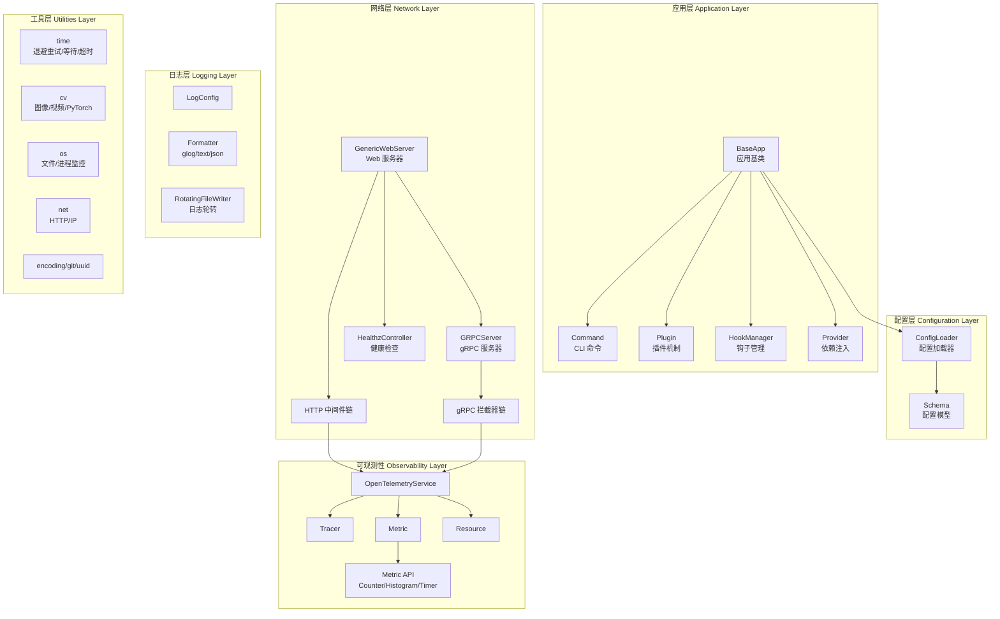
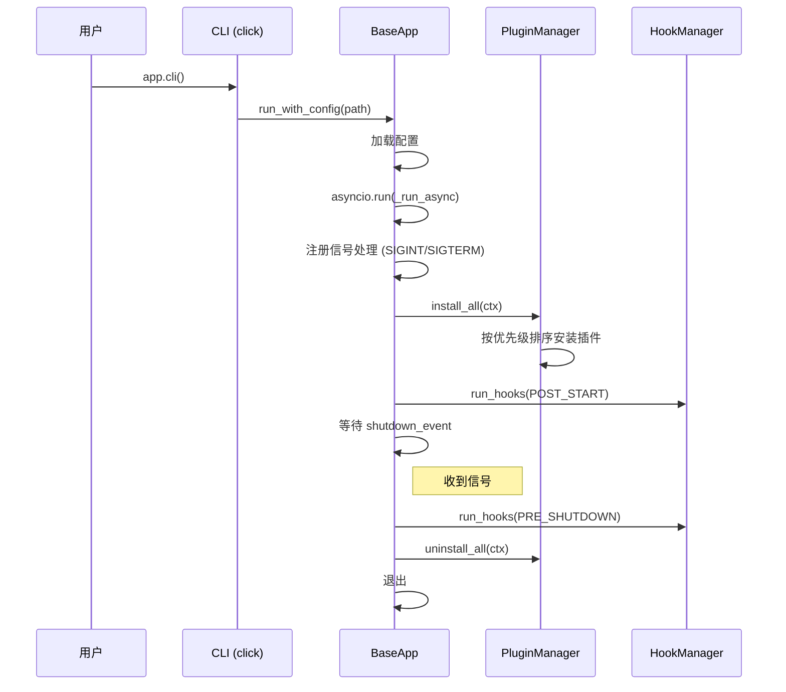
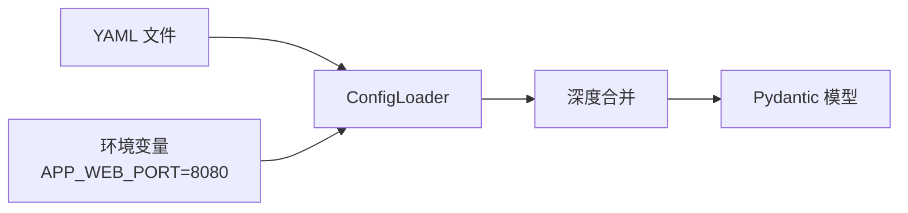
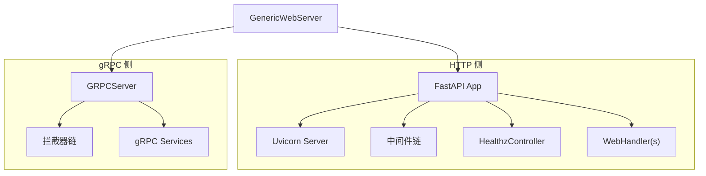
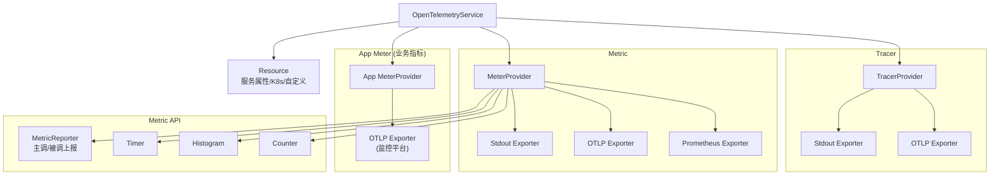

# Peek 设计文档

> **版本**: 0.0.1  
> **定位**: Python 微服务开发基础工具库  
> **License**: MIT

---

## 1. 项目概述

### 1.1 什么是 Peek

Peek 是一个面向 Python 微服务开发的基础工具库（Toolkit），参考了 Go 语言微服务框架的设计理念，提供了构建生产级 Python 微服务所需的通用基础能力。

Peek 的核心设计哲学：
- **约定优于配置**：提供合理的默认值，同时支持 YAML 配置文件深度自定义
- **可插拔架构**：通过 Plugin 机制实现组件的热插拔
- **生产级就绪**：内置日志轮转、健康检查、限流、可观测性等生产必备能力
- **上层可继承**：作为底座库，支持上层业务框架（如 tide）继承扩展

### 1.2 与 Tide 的关系

```
┌─────────────────────────────────────────────┐
│                 业务应用                      │
├─────────────────────────────────────────────┤
│              tide (业务框架)                  │
│   TideApp / TideConfig / 业务 Plugin        │
├─────────────────────────────────────────────┤
│              peek (基础工具库)                │
│   BaseApp / Config / WebServer / OTel / ... │
└─────────────────────────────────────────────┘
```

- **peek**：提供通用的、与业务无关的基础能力
- **tide**：继承 peek 的 BaseApp，叠加业务相关的配置、插件和命令

---

## 2. 整体架构

### 2.1 模块全景

```
peek/
├── app/             # 应用核心（生命周期、插件、钩子、依赖注入）
├── config/          # 配置管理（YAML + 环境变量 + Pydantic 模型）
├── logs/            # 日志框架（glog/text/json 格式、文件轮转）
├── net/             # 网络模块
│   ├── http.py      # HTTP 客户端（requests 封装）
│   ├── ip.py        # IP 地址工具
│   ├── webserver/   # Web 服务器框架（FastAPI + 中间件链）
│   └── grpc/        # gRPC 服务器（拦截器链 + 网关）
├── opentelemetry/   # 可观测性（Tracer + Metric + Resource）
├── cv/              # 计算机视觉
│   ├── image/       # 图像处理（缩放、裁剪、腐蚀）
│   ├── video/       # 视频处理（解码、截取、滤镜、智能缩放）
│   └── torch/       # PyTorch 工具（模型加载、ONNX 转换、推理）
├── ai/              # AI 工具
│   └── gpu/         # GPU 数据并行
├── os/              # 系统工具（文件操作、进程监控）
├── time/            # 时间工具（退避重试、等待轮询、超时控制）
├── encoding/        # 编码工具（Base64）
├── git/             # Git 工具（仓库信息获取）
└── uuid/            # UUID 生成
```

### 2.2 架构分层图



---

## 3. 核心模块详细设计

### 3.1 应用核心 (`peek.app`)

应用核心模块提供微服务的生命周期管理，是 peek 的骨架。

#### 3.1.1 BaseApp — 应用基类

`BaseApp` 是所有应用的基类，封装了通用的生命周期管理：



**核心特性**：
- **CLI 集成**：基于 `click` 实现命令行，默认提供 `serve` 和 `info` 命令
- **信号处理**：优雅处理 `SIGINT` / `SIGTERM` 信号
- **异步运行**：基于 `asyncio` 事件循环
- **子类扩展**：上层框架（如 tide）继承 `BaseApp` 并覆盖 `run_with_config()` 和 `_add_default_commands()`

#### 3.1.2 Plugin — 插件机制

插件系统是 peek 实现组件可插拔的核心。

```python
class Plugin(ABC):
    name: str = "base"       # 插件名称
    priority: int = 0        # 优先级（越大越先安装）
    enabled: bool = True     # 是否启用

    async def install(self, ctx) -> None: ...   # 安装
    async def uninstall(self, ctx) -> None: ... # 卸载
    def should_install(self, ctx) -> bool: ...  # 条件安装
```

**PluginManager 行为**：
- **安装**：按 `priority` 从高到低执行 `install()`
- **卸载**：按安装顺序的**反序**执行 `uninstall()`
- **容错**：安装失败时抛出异常并停止；卸载失败时记录日志并继续

#### 3.1.3 HookManager — 钩子管理

提供两种生命周期钩子：

| 钩子类型 | 执行时机 | 失败行为 |
|---------|---------|---------|
| `POST_START` | 所有插件安装完成后 | 抛出异常，终止启动 |
| `PRE_SHUTDOWN` | 收到关闭信号后，卸载插件前 | 记录日志，继续执行 |

钩子按 `priority` 从高到低执行，同时支持同步和异步函数。

#### 3.1.4 Provider — 依赖注入容器

全局单例的依赖注入容器，基于线程安全的双重检查锁定实现：

```python
provider = get_provider()

# 注册实例
provider.register("mysql", mysql_client)

# 注册工厂（延迟创建）
provider.register_factory("redis", lambda: RedisClient(...))

# 获取依赖
mysql = provider.get("mysql")
redis = provider.get_typed("redis", RedisClient)
```

**特性**：
- 线程安全的单例模式
- 支持直接注册实例和工厂函数（延迟创建）
- 类型安全的 `get_typed()` 方法
- 配置对象统一存储

---

### 3.2 配置管理 (`peek.config`)

#### 3.2.1 ConfigLoader — 配置加载器

支持三种配置来源的合并加载：



**环境变量覆盖规则**：
- 前缀过滤：`APP_WEB_BIND_ADDRESS_PORT=8080`
- 下划线分层映射到嵌套配置
- 自动类型推断（布尔、整数、浮点、列表）

**链式加载**：
```python
config = (
    ConfigLoader(env_prefix="APP")
    .load_file("base.yaml")
    .load_file("override.yaml")  # 后加载的覆盖先加载的
    .load_env()                  # 环境变量最高优先
    .to_model(MyConfig)
)
```

#### 3.2.2 Schema — 配置模型

基于 Pydantic v2 定义的类型安全配置模型体系：

| 模型 | 说明 | 关键字段 |
|------|------|---------|
| `WebConfig` | Web 服务器配置 | `bind_address`, `grpc`, `http`, `debug`, `shutdown`, `qps_limit` |
| `GrpcConfig` | gRPC 配置 | `port`, `timeout`, `max_recv_msg_size`, `max_send_msg_size` |
| `HttpConfig` | HTTP 配置 | `read_timeout`, `write_timeout`, `max_request_body_size`, `api_formatter` |
| `LogConfig` | 日志配置 | `level`, `format`, `filepath`, `max_age`, `rotate_interval`, `rotate_size` |
| `OpenTelemetryConfig` | OTel 配置 | `trace_*`, `metric_*`, `service_name` |
| `MonitorConfig` | 进程监控配置 | `interval`, `enable_gpu`, `include_children`, `history_size` |
| `QPSLimitConfig` | QPS 限流配置 | `default_qps`, `default_burst`, `max_concurrency`, `method_qps` |
| `ShutdownConfig` | 优雅关闭配置 | `delay_duration`, `timeout_duration` |
| `DebugConfig` | 调试配置 | `enable_profiling`, `profiling_path` |

所有时间相关字段均支持带单位字符串（如 `"30s"`, `"5m"`, `"1h"`），通过 `parse_duration` 自动转换。

---

### 3.3 日志框架 (`peek.logs`)

参考 Go 语言 glog 库实现，提供生产级日志能力。

#### 3.3.1 日志格式

| 格式 | 类 | 输出示例 |
|------|---|---------|
| `glog` | `GlogFormatter` | `I0223 12:00:00.000000 main.py:42] message` |
| `text` | `TextFormatter` | `2026-02-23 12:00:00 [INFO] main.py:42 - message` |
| `json` | `JsonFormatter` | `{"time":"2026-02-23T12:00:00","level":"INFO","msg":"message"}` |

#### 3.3.2 日志轮转

`RotatingFileWriter` / `RotatingFileHandler` 支持：
- **按大小轮转**：超过 `rotate_size` 后自动切换文件
- **按时间轮转**：按 `rotate_interval` 定时切换
- **自动清理**：超过 `max_age` 的日志文件自动删除
- **最大文件数**：超过 `max_count` 的旧日志自动清理

#### 3.3.3 输出重定向

| 模式 | 说明 |
|------|------|
| `stdout` | 仅输出到标准输出（默认） |
| `file` | 仅输出到文件 |
| `both` | 同时输出到标准输出和文件 |

#### 3.3.4 快速使用

```python
from peek.logs import install_logs, LogConfig

# 使用默认配置
install_logs()

# 自定义配置
install_logs(LogConfig(
    formatter="glog",
    level="info",
    redirect="both",
    filepath="./log",
    rotate_interval="1h",
    max_age="7d",
))
```

---

### 3.4 Web 服务器框架 (`peek.net.webserver`)

基于 FastAPI 封装的生产级 Web 服务器。

#### 3.4.1 GenericWebServer

`GenericWebServer` 是 Web 服务器的核心类，同时管理 HTTP 和 gRPC 服务：



**创建方式**：

```python
# 方式一：直接构造
server = GenericWebServer(host="0.0.0.0", port=8080)

# 方式二：从 YAML 配置文件创建（推荐）
server = GenericWebServer.from_config_file("config.yaml")

# 方式三：使用 Builder
config = (
    WebServerConfigBuilder()
    .with_bind_address("0.0.0.0", 8080)
    .with_grpc(port=50051, max_workers=10)
    .with_http(timeout="30s")
    .with_shutdown(delay="5s", timeout="10s")
    .build()
)
server = GenericWebServer.from_config(config)
```

#### 3.4.2 HTTP 中间件链

采用洋葱模型，中间件按**添加的反序**执行：

```
请求 → RequestID → Recovery → Timer → Logger → [Handler] → Logger → Timer → Recovery → RequestID → 响应
```

**内置中间件**：

| 中间件 | 说明 |
|--------|------|
| `RequestIDMiddleware` | 生成/透传 X-Request-ID |
| `RecoveryMiddleware` | 异常捕获与恢复 |
| `TimerMiddleware` | 请求计时（设置 start_time 到 state） |
| `LoggerMiddleware` | 请求/响应日志（支持 body 和 headers 记录，字符串截断） |
| `MaxBodySizeMiddleware` | 请求体大小限制 |
| `QPSRateLimitMiddleware` | QPS 令牌桶限流 |
| `ConcurrencyLimitMiddleware` | 并发数限流 |
| `TimeoutMiddleware` | 全局请求超时 |
| `PathTimeoutMiddleware` | 路径级超时 |
| `HttpTimerMiddleware` | HTTP 请求耗时统计 |
| `TraceMiddleware` | OpenTelemetry 分布式追踪 |
| `MetricMiddleware` | OpenTelemetry 指标采集 |

#### 3.4.3 健康检查

`HealthzController` 提供 K8s 标准的健康检查端点：

| 端点 | 说明 |
|------|------|
| `GET /healthz` | 综合健康检查 |
| `GET /healthz/verbose` | 详细检查结果 |
| `GET /livez` | 存活探针 |
| `GET /livez/verbose` | 详细存活结果 |
| `GET /readyz` | 就绪探针 |
| `GET /readyz/verbose` | 详细就绪结果 |

**内置检查器类型**：
- `PingHealthChecker`：基础 Ping（总是健康）
- `HTTPHealthChecker`：HTTP 端点检查
- `TCPHealthChecker`：TCP 连接检查
- `FuncHealthChecker`：自定义函数检查
- `CompositeHealthChecker`：组合检查器

---

### 3.5 gRPC 服务 (`peek.net.grpc`)

#### 3.5.1 GRPCServer

封装 `grpcio`，提供：
- 同步 (`GRPCServer`) 和异步 (`AsyncGRPCServer`) 服务器
- 健康检查协议 (`grpc.health.v1`)
- 反射服务 (`grpc.reflection`)
- 拦截器链支持

#### 3.5.2 gRPC 拦截器链

```python
chain = create_default_interceptor_chain()
# 包含: RequestID → Recovery → Logging → Timer
```

| 拦截器 | 说明 |
|--------|------|
| `RequestIDInterceptor` | Request ID 生成/透传 |
| `RecoveryInterceptor` | 异常捕获 |
| `LoggingInterceptor` | 请求日志 |
| `TimerInterceptor` | 请求计时 |
| `QPSLimitInterceptor` | QPS 限流 |
| `ConcurrencyLimitInterceptor` | 并发限流 |
| `TraceInterceptor` | 分布式追踪 |
| `MetricInterceptor` | 指标采集 |

#### 3.5.3 GRPCGateway

HTTP/gRPC 网关，支持将 HTTP 请求转发到 gRPC 服务。

---

### 3.6 可观测性 (`peek.opentelemetry`)

基于 OpenTelemetry SDK 实现完整的可观测性方案。

#### 3.6.1 整体架构



#### 3.6.2 Metric API

提供简洁的指标操作接口：

```python
from peek.opentelemetry.metric.api import Counter, Histogram, Timer

# Counter（计数器）
counter = Counter("http", "requests_total")
counter.with_attr("method", "GET").with_attr("status", 200).incr()

# Histogram（直方图）
histogram = Histogram("http", "request_duration_ms", unit="ms")
histogram.with_attrs(method="GET", path="/api").record(123.45)

# Timer（自动计时）
timer = Timer("business", "process_duration_ms")
with timer.with_attr("step", "validation").time():
    # 自动记录耗时
    pass
```

#### 3.6.3 MetricReporter

标准化的主调/被调指标上报：

```python
from peek.opentelemetry.metric.report import MetricReporter, ServerDimension, ClientDimension

reporter = MetricReporter()

# 被调指标
reporter.report_server_metric(
    ServerDimension(service="my-svc", method="/api/users", protocol="http", status_code=200, success=True),
    cost_ms=50.0,
)

# 主调指标
reporter.report_client_metric(
    ClientDimension(service="user-svc", method="/api/users", protocol="grpc", status_code=0, success=True),
    cost_ms=30.0,
)
```

#### 3.6.4 Resource

支持多种资源属性来源：
- 基础属性：`service.name`, `service.version`, `service.namespace`
- K8s 属性：自动从环境变量读取 Pod、Node 等信息
- 自定义属性：通过配置文件自定义键值对

---

### 3.7 时间工具 (`peek.time`)

#### 3.7.1 ExponentialBackOff — 指数退避

```python
from peek.time import retry, retry_sync, ExponentialBackOff

# 装饰器方式
@retry(max_retries=3, initial_interval=0.1)
async def call_remote():
    ...

# 同步版本
@retry_sync(max_retries=5)
def call_remote_sync():
    ...

# 直接使用 BackOff
backoff = ExponentialBackOff(initial_interval=0.1, max_interval=10.0, multiplier=2.0)
result = await retry_with_backoff(my_func, backoff)
```

#### 3.7.2 Wait / Poll — 等待与轮询

```python
from peek.time import poll, wait_for_condition, call_with_timeout, Timer

# 轮询直到条件满足
await poll(condition_func, interval=1.0, timeout=30.0)

# 等待条件（同步）
wait_for_condition_sync(check_func, timeout=10.0)

# 带超时调用
result = await call_with_timeout(async_func, timeout=5.0)

# 定时轮询
await until(func, period=1.0)               # 固定间隔
await jitter_until(func, period=1.0)         # 带抖动
await backoff_until(func, backoff_manager)   # 退避间隔
```

#### 3.7.3 FunctionDurationController — 函数耗时控制

控制函数执行耗时在预期范围内，适合用于帧率控制、节奏控制等场景。

#### 3.7.4 parse_duration — 时间字符串解析

```python
from peek.time import parse_duration

parse_duration("30s")   # 30.0
parse_duration("5m")    # 300.0
parse_duration("1h")    # 3600.0
parse_duration("1d")    # 86400.0
parse_duration("100")   # 100.0（默认秒）
```

---

### 3.8 计算机视觉 (`peek.cv`)

#### 3.8.1 视频处理 (`peek.cv.video`)

功能全面的视频处理工具集：

| 组件 | 说明 |
|------|------|
| `VideoDecoder` | 视频解码门面类，统一多种解码后端 |
| `DecordDecoder` | 基于 decord 的高性能解码器 |
| `OpenCVDecoder` | 基于 OpenCV 的解码器 |
| `FFmpegDecoder` | 基于 ffmpeg-python 的解码器 |
| `VideoInfo` / `probe` | 视频信息探测（分辨率、帧率、时长等） |
| `VideoClip` | 视频截取（按时间段裁剪、分割） |
| `VideoFilter` | 链式滤镜（缩放、裁剪、旋转/翻转） |
| `smart_resize` | Qwen2-VL 风格的智能缩放 |

```python
from peek.cv.video import VideoDecoder, VideoDecodeMethod

decoder = VideoDecoder(video_path="input.mp4", method=VideoDecodeMethod.DECORD)
frames = decoder.decode()
```

#### 3.8.2 图像处理 (`peek.cv.image`)

| 函数 | 说明 |
|------|------|
| `pad_resize_image` | 等比缩放并填充黑边 |
| `resize_crop_image` | 缩放后裁剪去除填充 |
| `edge_strip` | 边缘裁剪 |
| `erode` | 按宽高比腐蚀 |

#### 3.8.3 PyTorch 工具 (`peek.cv.torch`)

| 模块 | 说明 |
|------|------|
| `device.py` | GPU 设备选择 |
| `model.py` | 模型加载 |
| `inference.py` | 推理封装 |
| `transform.py` | 数据变换 |
| `convert_onnx.py` | PyTorch → ONNX 转换 |

---

### 3.9 系统工具 (`peek.os`)

#### 3.9.1 文件操作

```python
from peek.os import ensure_dir, file_exists, read_file, write_file

ensure_dir("/path/to/dir")  # 递归创建目录
content = read_file("file.txt")
write_file("output.txt", content, create_dirs=True)
```

#### 3.9.2 进程监控 (`peek.os.monitor`)

| 组件 | 说明 |
|------|------|
| `collector.py` | 进程资源采集器（CPU、内存、GPU、子进程） |
| `service.py` | 监控服务（持续采集、历史记录） |
| `visualizer.py` | 可视化工具（生成资源使用图表） |

---

### 3.10 其他工具模块

| 模块 | 说明 | 主要接口 |
|------|------|---------|
| `peek.net.http` | HTTP 客户端封装 | `get()`, `post()`, `post_json()`，内置自动重试 |
| `peek.net.ip` | IP 地址工具 | `get_host_ip()` |
| `peek.encoding.base64` | Base64 编码 | `encode(filepath)` |
| `peek.git` | Git 操作 | `get_repo_info()`, `get_file_repo_dir()` |
| `peek.uuid` | UUID 生成 | `gen_uuid()` |

---

## 4. 配置参考

### 4.1 完整 YAML 配置示例

```yaml
# ============ Web 服务器配置 ============
web:
  bind_address:
    host: "0.0.0.0"
    port: 8080

  grpc:
    port: 50051
    timeout: "30s"
    max_recv_msg_size: 104857600       # 100MB
    max_send_msg_size: 104857600

  http:
    read_timeout: "30s"
    write_timeout: "30s"
    max_request_body_size: 0           # 0 = 不限制
    api_formatter: "trivial_api_v20"

  shutdown:
    delay_duration: "0s"
    timeout_duration: "5s"

  # HTTP QPS 限流
  http_qps_limit:
    default_qps: 1000
    default_burst: 2000
    max_concurrency: 500
    wait_timeout: "1s"
    method_qps:
      - method: "POST"
        path: "/api/heavy"
        qps: 100
        burst: 200

  # gRPC QPS 限流
  grpc_qps_limit:
    default_qps: 5000
    default_burst: 10000

# ============ 日志配置 ============
log:
  level: "info"
  format: "text"
  filepath: "./log"
  max_age: "7d"
  rotate_interval: "1h"
  rotate_size: 104857600               # 100MB

# ============ OpenTelemetry 配置 ============
open_telemetry:
  enabled: true

  tracer:
    enabled: true
    exporter_type: "otlp"
    sample_ratio: 1.0
    otlp:
      endpoint: "localhost:4317"
      protocol: "grpc"

  metric:
    enabled: true
    exporter_type: "prometheus"
    prometheus:
      url: "/metrics"

  app_meter_provider:
    enabled: true
    exporter_type: "otlp"
    otlp:
      endpoint: "prometheus.tencentcloudapi.com:4317"
      temporality: "delta"

  resource:
    service_name: "my-service"
    service_version: "1.0.0"
    k8s:
      enabled: true

# ============ 进程监控配置 ============
monitor:
  enabled: true
  auto_start: true
  interval: 5.0
  enable_gpu: true
  include_children: true
  history_size: 3600
```

---

## 5. 使用指南

### 5.1 安装

```bash
# 基础安装
pip install -e .

# 开发模式（含测试、lint 工具）
pip install -e .[dev]

# 生产模式（含 OpenTelemetry、gRPC）
pip install -e .[prod]

# 计算机视觉模块
pip install -e .[cv]

# 全部依赖
pip install -e .[all]
```

### 5.2 快速开始 — 创建一个 Web 服务

```python
from peek.net.webserver import GenericWebServer, WebHandler

class MyHandler(WebHandler):
    def set_routes(self, app):
        @app.get("/hello")
        async def hello():
            return {"message": "Hello, World!"}

# 从配置文件创建（推荐）
server = GenericWebServer.from_config_file("config.yaml")
server.install_web_handler(MyHandler())
server.run()
```

### 5.3 作为上层框架的底座

peek 设计为可继承的底座库，上层框架（如 tide）的典型继承方式：

```python
from peek.app import BaseApp
from peek.config import ConfigLoader

class TideApp(BaseApp):
    """业务框架应用类"""

    def __init__(self, name="tide-app", **kwargs):
        super().__init__(name=name, **kwargs)
        # 注册业务插件
        self.register_plugin(MySQLPlugin())
        self.register_plugin(WebServerPlugin())

    def run_with_config(self, config_path: str) -> None:
        """覆盖配置加载逻辑"""
        config = ConfigLoader().load_file(config_path).to_model(TideConfig)
        self.run(config)
```

### 5.4 开发命令

```bash
# 格式化代码
./scripts/format.sh

# 代码检查
./scripts/lint.sh

# 运行测试
./scripts/test.sh

# 运行特定测试
pytest tests/unit/test_http.py -v
```

---

## 6. 依赖说明

### 6.1 核心依赖

| 依赖 | 版本 | 用途 |
|------|------|------|
| `fastapi` | ≥0.100.0 | Web 框架 |
| `uvicorn` | ≥0.23.0 | ASGI 服务器 |
| `pydantic` | ≥2.0.0 | 数据校验与配置模型 |
| `pydantic-settings` | ≥2.0.0 | 配置管理 |
| `PyYAML` | ≥6.0 | YAML 解析 |
| `requests` | ≥2.28.0 | HTTP 客户端 |
| `httpx` | ≥0.24.0 | 异步 HTTP 客户端 |
| `click` | - | CLI 框架（BaseApp 依赖） |
| `psutil` | ≥5.9.0 | 进程监控 |

### 6.2 可选依赖

| 分组 | 依赖 | 用途 |
|------|------|------|
| `prod` | `opentelemetry-*` | 可观测性 |
| `prod` | `grpcio`, `grpcio-tools` | gRPC |
| `prod` | `gunicorn` | 生产级 ASGI 部署 |
| `cv` | `av`, `opencv-python`, `ffmpeg-python` | 视频/图像处理 |
| `monitor` | `pynvml`, `matplotlib` | GPU 监控与可视化 |
| `dev` | `pytest`, `black`, `mypy`, `flake8` | 开发工具 |

---

## 7. 设计决策与最佳实践

### 7.1 为什么选择 Pydantic v2 做配置？

- 类型安全：编译时即可发现配置错误
- 自动校验：字段约束（范围、格式）自动生效
- 文档化：`Field(description=...)` 即为文档
- 环境变量支持：天然与 `pydantic-settings` 集成

### 7.2 为什么参考 Go 的设计？

- Go 的微服务生态已经成熟，很多模式经过了大规模生产验证
- 日志（glog 格式）、健康检查（K8s liveness/readiness）、拦截器链等模式直接复用
- 配置结构参考 protobuf 定义，确保跨语言一致性

### 7.3 中间件链 vs 装饰器

peek 选择了**中间件链（Handler Chain）**模式而非 Python 常见的装饰器模式，原因：
- 中间件顺序可配置，装饰器顺序是硬编码的
- 中间件可以动态添加/移除
- 与 gRPC 拦截器链保持一致的心智模型

### 7.4 延迟导入策略

`peek.net.grpc` 和 `peek.net.webserver` 使用延迟导入（`__getattr__`），避免：
- 未安装 gRPC 依赖时导入报错
- 循环依赖问题
- 不必要的初始化开销