# Peek 设计文档

> **版本**: 0.0.1  
> **定位**: Python 微服务开发基础工具库  
> **License**: MIT

---

## 1. 项目概述

### 1.1 什么是 Peek

Peek 是一个面向 Python 微服务开发的基础工具库（Toolkit），参考了 Go 语言微服务框架的设计理念，提供了构建生产级 Python 微服务所需的通用基础能力。

Peek 的核心设计哲学：
- **约定优于配置**：提供合理的默认值，同时支持 YAML 配置文件深度自定义
- **可插拔架构**：通过 Plugin 机制实现组件的热插拔
- **生产级就绪**：内置日志轮转、健康检查、限流、可观测性等生产必备能力
- **上层可继承**：作为底座库，支持上层业务框架（如 tide）继承扩展

### 1.2 与 Tide 的关系

```
┌─────────────────────────────────────────────┐
│                 业务应用                      │
├─────────────────────────────────────────────┤
│              tide (业务框架)                  │
│   TideApp / TideConfig / 业务 Plugin        │
├─────────────────────────────────────────────┤
│              peek (基础工具库)                │
│   BaseApp / Config / WebServer / OTel / ... │
└─────────────────────────────────────────────┘
```

- **peek**：提供通用的、与业务无关的基础能力
- **tide**：继承 peek 的 BaseApp，叠加业务相关的配置、插件和命令

---

## 2. 整体架构

### 2.1 模块全景

```
peek/
├── app/             # 应用核心（生命周期、插件、钩子、依赖注入）
├── config/          # 配置管理（YAML + 环境变量 + Pydantic 模型）
├── logs/            # 日志框架（glog/text/json 格式、文件轮转）
├── net/             # 网络模块
│   ├── http.py      # HTTP 客户端（requests 封装）
│   ├── ip.py        # IP 地址工具
│   ├── webserver/   # Web 服务器框架（FastAPI + 中间件链）
│   └── grpc/        # gRPC 服务器（拦截器链 + 网关）
├── opentelemetry/   # 可观测性（Tracer + Metric + Resource）
├── cv/              # 计算机视觉
│   ├── image/       # 图像处理（缩放、裁剪、腐蚀）
│   ├── video/       # 视频处理（解码、截取、滤镜、智能缩放）
│   └── torch/       # PyTorch 工具（模型加载、ONNX 转换、推理）
├── ai/              # AI 工具
│   └── gpu/         # GPU 数据并行
├── os/              # 系统工具（文件操作、进程监控）
├── time/            # 时间工具（退避重试、等待轮询、超时控制）
├── encoding/        # 编码工具（Base64）
├── git/             # Git 工具（仓库信息获取）
└── uuid/            # UUID 生成
```

### 2.2 架构分层图

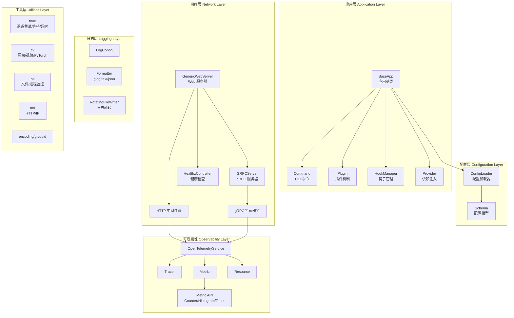

---

## 3. 核心模块详细设计

### 3.1 应用核心 (`peek.app`)

应用核心模块提供微服务的生命周期管理，是 peek 的骨架。

#### 3.1.1 BaseApp — 应用基类

`BaseApp` 是所有应用的基类，封装了通用的生命周期管理：

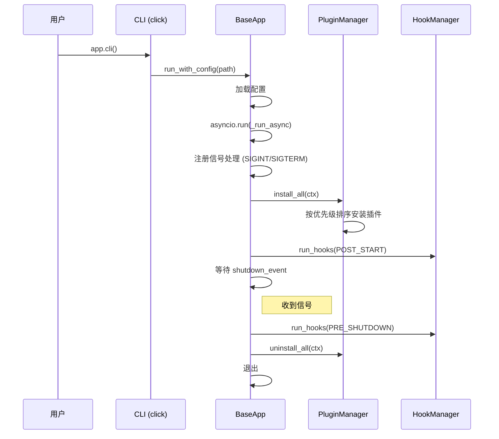

**核心特性**：
- **CLI 集成**：基于 `click` 实现命令行，默认提供 `serve` 和 `info` 命令
- **信号处理**：优雅处理 `SIGINT` / `SIGTERM` 信号
- **异步运行**：基于 `asyncio` 事件循环
- **子类扩展**：上层框架（如 tide）继承 `BaseApp` 并覆盖 `run_with_config()` 和 `_add_default_commands()`

#### 3.1.2 Plugin — 插件机制

插件系统是 peek 实现组件可插拔的核心。

```python
class Plugin(ABC):
    name: str = "base"       # 插件名称
    priority: int = 0        # 优先级（越大越先安装）
    enabled: bool = True     # 是否启用

    async def install(self, ctx) -> None: ...   # 安装
    async def uninstall(self, ctx) -> None: ... # 卸载
    def should_install(self, ctx) -> bool: ...  # 条件安装
```

**PluginManager 行为**：
- **安装**：按 `priority` 从高到低执行 `install()`
- **卸载**：按安装顺序的**反序**执行 `uninstall()`
- **容错**：安装失败时抛出异常并停止；卸载失败时记录日志并继续

#### 3.1.3 HookManager — 钩子管理

提供两种生命周期钩子：

| 钩子类型 | 执行时机 | 失败行为 |
|---------|---------|---------|
| `POST_START` | 所有插件安装完成后 | 抛出异常，终止启动 |
| `PRE_SHUTDOWN` | 收到关闭信号后，卸载插件前 | 记录日志，继续执行 |

钩子按 `priority` 从高到低执行，同时支持同步和异步函数。

#### 3.1.4 Provider — 依赖注入容器

全局单例的依赖注入容器，基于线程安全的双重检查锁定实现：

```python
provider = get_provider()

# 注册实例
provider.register("mysql", mysql_client)

# 注册工厂（延迟创建）
provider.register_factory("redis", lambda: RedisClient(...))

# 获取依赖
mysql = provider.get("mysql")
redis = provider.get_typed("redis", RedisClient)
```

**特性**：
- 线程安全的单例模式
- 支持直接注册实例和工厂函数（延迟创建）
- 类型安全的 `get_typed()` 方法
- 配置对象统一存储

---

### 3.2 配置管理 (`peek.config`)

#### 3.2.1 ConfigLoader — 配置加载器

支持三种配置来源的合并加载：

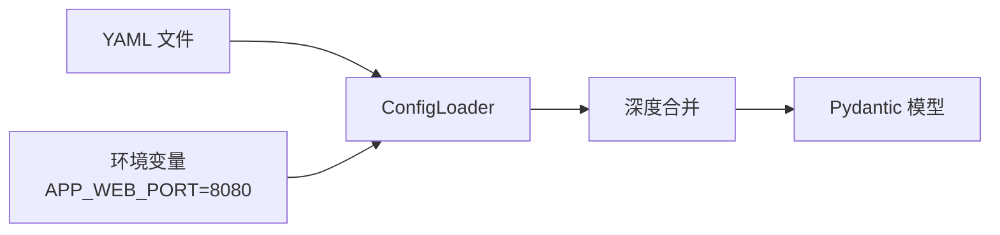

**环境变量覆盖规则**：
- 前缀过滤：`APP_WEB_BIND_ADDRESS_PORT=8080`
- 下划线分层映射到嵌套配置
- 自动类型推断（布尔、整数、浮点、列表）

**链式加载**：
```python
config = (
    ConfigLoader(env_prefix="APP")
    .load_file("base.yaml")
    .load_file("override.yaml")  # 后加载的覆盖先加载的
    .load_env()                  # 环境变量最高优先
    .to_model(MyConfig)
)
```

#### 3.2.2 Schema — 配置模型

基于 Pydantic v2 定义的类型安全配置模型体系：

| 模型 | 说明 | 关键字段 |
|------|------|---------|
| `WebConfig` | Web 服务器配置 | `bind_address`, `grpc`, `http`, `debug`, `shutdown`, `qps_limit` |
| `GrpcConfig` | gRPC 配置 | `port`, `timeout`, `max_recv_msg_size`, `max_send_msg_size` |
| `HttpConfig` | HTTP 配置 | `read_timeout`, `write_timeout`, `max_request_body_size`, `api_formatter` |
| `LogConfig` | 日志配置 | `level`, `format`, `filepath`, `max_age`, `rotate_interval`, `rotate_size` |
| `OpenTelemetryConfig` | OTel 配置 | `trace_*`, `metric_*`, `service_name` |
| `MonitorConfig` | 进程监控配置 | `interval`, `enable_gpu`, `include_children`, `history_size` |
| `QPSLimitConfig` | QPS 限流配置 | `default_qps`, `default_burst`, `max_concurrency`, `method_qps` |
| `ShutdownConfig` | 优雅关闭配置 | `delay_duration`, `timeout_duration` |
| `DebugConfig` | 调试配置 | `enable_profiling`, `profiling_path` |

所有时间相关字段均支持带单位字符串（如 `"30s"`, `"5m"`, `"1h"`），通过 `parse_duration` 自动转换。

---

### 3.3 日志框架 (`peek.logs`)

参考 Go 语言 glog 库实现，提供生产级日志能力。

#### 3.3.1 日志格式

| 格式 | 类 | 输出示例 |
|------|---|---------|
| `glog` | `GlogFormatter` | `I0223 12:00:00.000000 main.py:42] message` |
| `text` | `TextFormatter` | `2026-02-23 12:00:00 [INFO] main.py:42 - message` |
| `json` | `JsonFormatter` | `{"time":"2026-02-23T12:00:00","level":"INFO","msg":"message"}` |

#### 3.3.2 日志轮转

`RotatingFileWriter` / `RotatingFileHandler` 支持：
- **按大小轮转**：超过 `rotate_size` 后自动切换文件
- **按时间轮转**：按 `rotate_interval` 定时切换
- **自动清理**：超过 `max_age` 的日志文件自动删除
- **最大文件数**：超过 `max_count` 的旧日志自动清理

#### 3.3.3 输出重定向

| 模式 | 说明 |
|------|------|
| `stdout` | 仅输出到标准输出（默认） |
| `file` | 仅输出到文件 |
| `both` | 同时输出到标准输出和文件 |

#### 3.3.4 快速使用

```python
from peek.logs import install_logs, LogConfig

# 使用默认配置
install_logs()

# 自定义配置
install_logs(LogConfig(
    formatter="glog",
    level="info",
    redirect="both",
    filepath="./log",
    rotate_interval="1h",
    max_age="7d",
))
```

---

### 3.4 Web 服务器框架 (`peek.net.webserver`)

基于 FastAPI 封装的生产级 Web 服务器。

#### 3.4.1 GenericWebServer

`GenericWebServer` 是 Web 服务器的核心类，同时管理 HTTP 和 gRPC 服务：

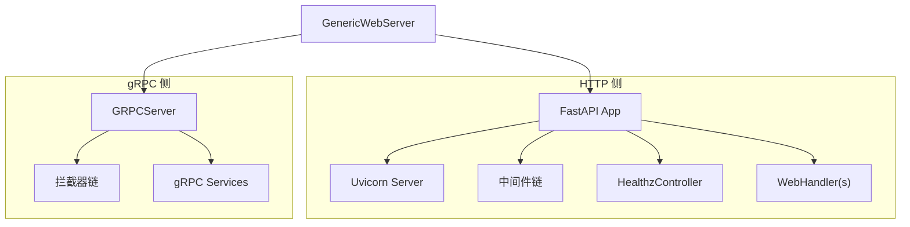

**创建方式**：

```python
# 方式一：直接构造
server = GenericWebServer(host="0.0.0.0", port=8080)

# 方式二：从 YAML 配置文件创建（推荐）
server = GenericWebServer.from_config_file("config.yaml")

# 方式三：使用 Builder
config = (
    WebServerConfigBuilder()
    .with_bind_address("0.0.0.0", 8080)
    .with_grpc(port=50051, max_workers=10)
    .with_http(timeout="30s")
    .with_shutdown(delay="5s", timeout="10s")
    .build()
)
server = GenericWebServer.from_config(config)
```

#### 3.4.2 HTTP 中间件链

采用洋葱模型，中间件按**添加的反序**执行：

```
请求 → RequestID → Recovery → Timer → Logger → [Handler] → Logger → Timer → Recovery → RequestID → 响应
```

**内置中间件**：

| 中间件 | 说明 |
|--------|------|
| `RequestIDMiddleware` | 生成/透传 X-Request-ID，自动回写到 response body |
| `RecoveryMiddleware` | 异常捕获与恢复 |
| `TimerMiddleware` | 请求计时（设置 start_time 到 state） |
| `LoggerMiddleware` | 请求/响应日志（支持 body 和 headers 记录，字符串截断） |
| `MaxBodySizeMiddleware` | 请求体大小限制 |
| `QPSRateLimitMiddleware` | QPS 令牌桶限流 |
| `ConcurrencyLimitMiddleware` | 并发数限流 |
| `TimeoutMiddleware` | 全局请求超时 |
| `PathTimeoutMiddleware` | 路径级超时 |
| `HttpTimerMiddleware` | HTTP 请求耗时统计 |
| `TraceMiddleware` | OpenTelemetry 分布式追踪 |
| `MetricMiddleware` | OpenTelemetry 指标采集 |

##### 3.4.2.1 RequestID 自动填充机制

参考 Go 项目 `HandleReuestId` 拦截器，`RequestIDMiddleware`（HTTP 侧）和 `RequestIDInterceptor`（gRPC 侧）在中间件/拦截器层统一完成 request_id 的提取、生成和自动回写，**业务 Controller 无需关心 request_id 的填充逻辑**。

**设计背景**：
- 当请求未传 `RequestId` 时，响应中 `RequestId` 不应为空，应自动使用服务内部生成的标识填充
- 该逻辑应在中间件层统一完成（而非在每个 Controller 方法中手动处理），这样所有接口自动受益

**HTTP 侧 — `RequestIDMiddleware`（纯 ASGI 实现）**

采用纯 ASGI 中间件实现（不继承 `BaseHTTPMiddleware`），确保与 OpenTelemetry `FastAPIInstrumentor` 完全兼容。

处理流程：

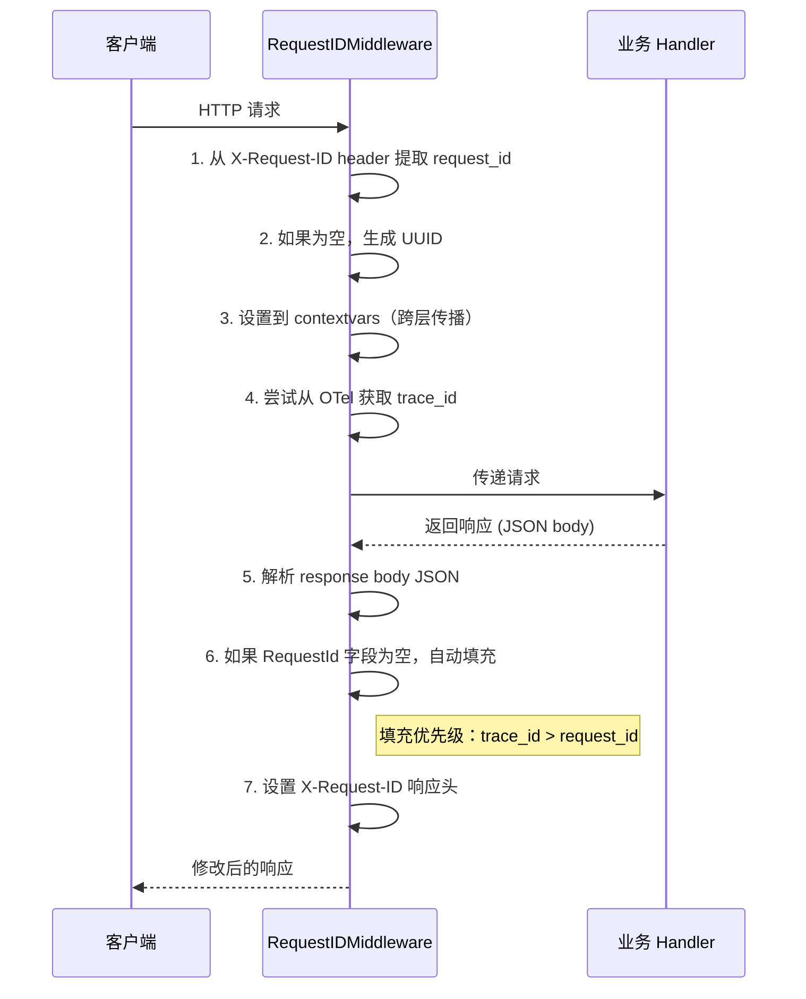

**request_id 解析优先级**：
1. 请求 `X-Request-ID` Header（调用方显式传入）
2. 自动生成 UUID（兜底）

**response body 自动填充规则**：
- 仅处理 `application/json` 类型的响应
- 查找响应 JSON 中的 `RequestId` 或 `request_id` 字段
- 如果字段**存在但为空** → 自动填充（优先 trace_id，其次 request_id）
- 如果字段**不为空**（业务层已显式设置） → 保持不变
- 如果字段**不存在** → 不修改

**为什么使用纯 ASGI 实现**：
- `BaseHTTPMiddleware` 在与 OpenTelemetry `FastAPIInstrumentor.instrument_app()` 配合使用时，`dispatch` 方法可能不被调用（OTel 会替换 FastAPI 的 `build_middleware_stack`，重建中间件栈时 `BaseHTTPMiddleware` 的执行链可能被绕过）
- 纯 ASGI 中间件通过直接拦截 `send` 回调实现 response body 修改，不受 OTel instrumentation 影响

**gRPC 侧 — `RequestIDInterceptor`**

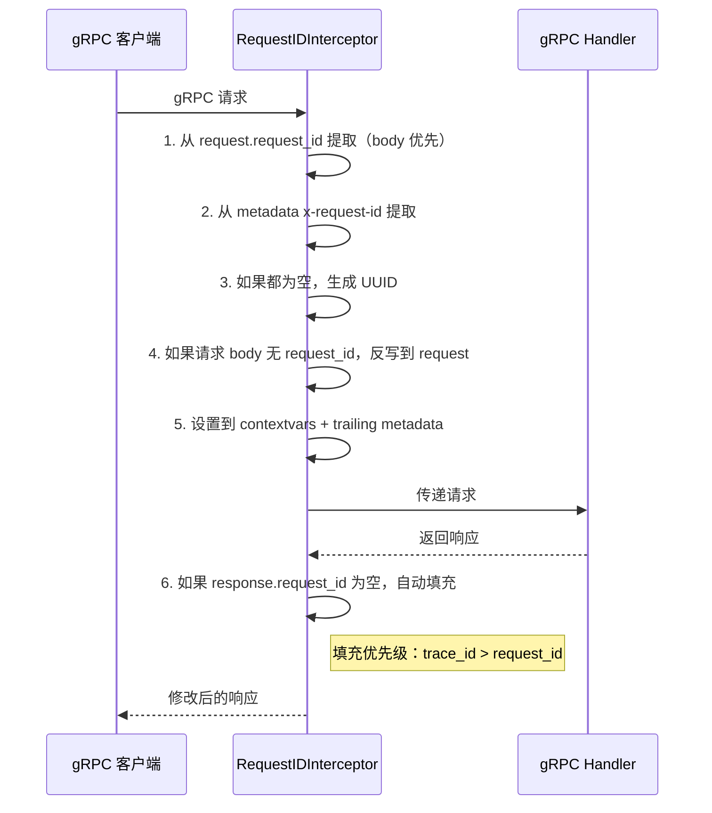

**request_id 解析优先级**（与 Go 的 `HandleReuestId` 一致）：
1. 请求 body 中的 `request_id`（`reflect_.RetrieveId(req, ...)`）
2. gRPC metadata 中的 `x-request-id`
3. OTel trace_id
4. 自动生成 UUID（兜底）

**示例**：

```bash
# 不传 RequestId → 中间件自动填充
$ curl -X POST http://localhost:10001/Now
{"RequestId": "7a5291d6c74e98949af613231e899b50", "Date": "2026-02-23 14:15:42", "Error": null}

# 传 RequestId → 保持原值
$ curl -X POST http://localhost:10001/Now -H "Content-Type: application/json" -d '{"RequestId": "my-custom-id"}'
{"RequestId": "my-custom-id", "Date": "2026-02-23 14:15:43", "Error": null}
```

#### 3.4.3 健康检查

`HealthzController` 提供 K8s 标准的健康检查端点：

| 端点 | 说明 |
|------|------|
| `GET /healthz` | 综合健康检查 |
| `GET /healthz/verbose` | 详细检查结果 |
| `GET /livez` | 存活探针 |
| `GET /livez/verbose` | 详细存活结果 |
| `GET /readyz` | 就绪探针 |
| `GET /readyz/verbose` | 详细就绪结果 |

**内置检查器类型**：
- `PingHealthChecker`：基础 Ping（总是健康）
- `HTTPHealthChecker`：HTTP 端点检查
- `TCPHealthChecker`：TCP 连接检查
- `FuncHealthChecker`：自定义函数检查
- `CompositeHealthChecker`：组合检查器

---

### 3.5 gRPC 服务 (`peek.net.grpc`)

#### 3.5.1 GRPCServer

封装 `grpcio`，提供：
- 同步 (`GRPCServer`) 和异步 (`AsyncGRPCServer`) 服务器
- 健康检查协议 (`grpc.health.v1`)
- 反射服务 (`grpc.reflection`)
- 拦截器链支持

#### 3.5.2 gRPC 拦截器链

```python
chain = create_default_interceptor_chain()
# 包含: RequestID → Recovery → Logging → Timer
```

| 拦截器 | 说明 |
|--------|------|
| `RequestIDInterceptor` | Request ID 生成/透传，自动回写到 response |
| `RecoveryInterceptor` | 异常捕获 |
| `LoggingInterceptor` | 请求日志 |
| `TimerInterceptor` | 请求计时 |
| `QPSLimitInterceptor` | QPS 限流 |
| `ConcurrencyLimitInterceptor` | 并发限流 |
| `TraceInterceptor` | 分布式追踪 |
| `MetricInterceptor` | 指标采集 |

#### 3.5.3 GRPCGateway

HTTP/gRPC 网关，支持将 HTTP 请求转发到 gRPC 服务。

---

### 3.6 可观测性 (`peek.opentelemetry`)

基于 OpenTelemetry SDK 实现完整的可观测性方案。

#### 3.6.1 整体架构

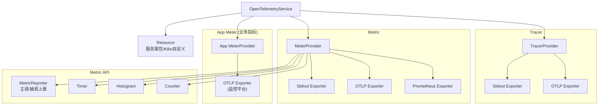

#### 3.6.2 Metric API

提供简洁的指标操作接口：

```python
from peek.opentelemetry.metric.api import Counter, Histogram, Timer

# Counter（计数器）
counter = Counter("http", "requests_total")
counter.with_attr("method", "GET").with_attr("status", 200).incr()

# Histogram（直方图）
histogram = Histogram("http", "request_duration_ms", unit="ms")
histogram.with_attrs(method="GET", path="/api").record(123.45)

# Timer（自动计时）
timer = Timer("business", "process_duration_ms")
with timer.with_attr("step", "validation").time():
    # 自动记录耗时
    pass
```

#### 3.6.3 MetricReporter

标准化的主调/被调指标上报：

```python
from peek.opentelemetry.metric.report import MetricReporter, ServerDimension, ClientDimension

reporter = MetricReporter()

# 被调指标
reporter.report_server_metric(
    ServerDimension(service="my-svc", method="/api/users", protocol="http", status_code=200, success=True),
    cost_ms=50.0,
)

# 主调指标
reporter.report_client_metric(
    ClientDimension(service="user-svc", method="/api/users", protocol="grpc", status_code=0, success=True),
    cost_ms=30.0,
)
```

#### 3.6.4 Resource

支持多种资源属性来源：
- 基础属性：`service.name`, `service.version`, `service.namespace`
- K8s 属性：自动从环境变量读取 Pod、Node 等信息
- 自定义属性：通过配置文件自定义键值对

---

### 3.7 时间工具 (`peek.time`)

#### 3.7.1 ExponentialBackOff — 指数退避

```python
from peek.time import retry, retry_sync, ExponentialBackOff

# 装饰器方式
@retry(max_retries=3, initial_interval=0.1)
async def call_remote():
    ...

# 同步版本
@retry_sync(max_retries=5)
def call_remote_sync():
    ...

# 直接使用 BackOff
backoff = ExponentialBackOff(initial_interval=0.1, max_interval=10.0, multiplier=2.0)
result = await retry_with_backoff(my_func, backoff)
```

#### 3.7.2 Wait / Poll — 等待与轮询

```python
from peek.time import poll, wait_for_condition, call_with_timeout, Timer

# 轮询直到条件满足
await poll(condition_func, interval=1.0, timeout=30.0)

# 等待条件（同步）
wait_for_condition_sync(check_func, timeout=10.0)

# 带超时调用
result = await call_with_timeout(async_func, timeout=5.0)

# 定时轮询
await until(func, period=1.0)               # 固定间隔
await jitter_until(func, period=1.0)         # 带抖动
await backoff_until(func, backoff_manager)   # 退避间隔
```

#### 3.7.3 FunctionDurationController — 函数耗时控制

控制函数执行耗时在预期范围内，适合用于帧率控制、节奏控制等场景。

#### 3.7.4 parse_duration — 时间字符串解析

```python
from peek.time import parse_duration

parse_duration("30s")   # 30.0
parse_duration("5m")    # 300.0
parse_duration("1h")    # 3600.0
parse_duration("1d")    # 86400.0
parse_duration("100")   # 100.0（默认秒）
```

---

### 3.8 计算机视觉 (`peek.cv`)

#### 3.8.1 视频处理 (`peek.cv.video`)

功能全面的视频处理工具集：

| 组件 | 说明 |
|------|------|
| `VideoDecoder` | 视频解码门面类，统一多种解码后端 |
| `DecordDecoder` | 基于 decord 的高性能解码器 |
| `OpenCVDecoder` | 基于 OpenCV 的解码器 |
| `FFmpegDecoder` | 基于 ffmpeg-python 的解码器 |
| `VideoInfo` / `probe` | 视频信息探测（分辨率、帧率、时长等） |
| `VideoClip` | 视频截取（按时间段裁剪、分割） |
| `VideoFilter` | 链式滤镜（缩放、裁剪、旋转/翻转） |
| `smart_resize` | Qwen2-VL 风格的智能缩放 |

```python
from peek.cv.video import VideoDecoder, VideoDecodeMethod

decoder = VideoDecoder(video_path="input.mp4", method=VideoDecodeMethod.DECORD)
frames = decoder.decode()
```

#### 3.8.2 图像处理 (`peek.cv.image`)

| 函数 | 说明 |
|------|------|
| `pad_resize_image` | 等比缩放并填充黑边 |
| `resize_crop_image` | 缩放后裁剪去除填充 |
| `edge_strip` | 边缘裁剪 |
| `erode` | 按宽高比腐蚀 |

#### 3.8.3 PyTorch 工具 (`peek.cv.torch`)

| 模块 | 说明 |
|------|------|
| `device.py` | GPU 设备选择 |
| `model.py` | 模型加载 |
| `inference.py` | 推理封装 |
| `transform.py` | 数据变换 |
| `convert_onnx.py` | PyTorch → ONNX 转换 |

---

### 3.9 系统工具 (`peek.os`)

#### 3.9.1 文件操作

```python
from peek.os import ensure_dir, file_exists, read_file, write_file

ensure_dir("/path/to/dir")  # 递归创建目录
content = read_file("file.txt")
write_file("output.txt", content, create_dirs=True)
```

#### 3.9.2 进程监控 (`peek.os.monitor`)

| 组件 | 说明 |
|------|------|
| `collector.py` | 进程资源采集器（CPU、内存、GPU、子进程） |
| `service.py` | 监控服务（持续采集、历史记录） |
| `visualizer.py` | 可视化工具（生成资源使用图表） |

---

### 3.10 其他工具模块

| 模块 | 说明 | 主要接口 |
|------|------|---------|
| `peek.net.http` | HTTP 客户端封装 | `get()`, `post()`, `post_json()`，内置自动重试 |
| `peek.net.ip` | IP 地址工具 | `get_host_ip()` |
| `peek.encoding.base64` | Base64 编码 | `encode(filepath)` |
| `peek.git` | Git 操作 | `get_repo_info()`, `get_file_repo_dir()` |
| `peek.uuid` | UUID 生成 | `gen_uuid()` |

---

## 4. 配置参考

### 4.1 完整 YAML 配置示例

```yaml
# ============ Web 服务器配置 ============
web:
  bind_address:
    host: "0.0.0.0"
    port: 8080

  grpc:
    port: 50051
    timeout: "30s"
    max_recv_msg_size: 104857600       # 100MB
    max_send_msg_size: 104857600

  http:
    read_timeout: "30s"
    write_timeout: "30s"
    max_request_body_size: 0           # 0 = 不限制
    api_formatter: "trivial_api_v20"

  shutdown:
    delay_duration: "0s"
    timeout_duration: "5s"

  # HTTP QPS 限流
  http_qps_limit:
    default_qps: 1000
    default_burst: 2000
    max_concurrency: 500
    wait_timeout: "1s"
    method_qps:
      - method: "POST"
        path: "/api/heavy"
        qps: 100
        burst: 200

  # gRPC QPS 限流
  grpc_qps_limit:
    default_qps: 5000
    default_burst: 10000

# ============ 日志配置 ============
log:
  level: "info"
  format: "text"
  filepath: "./log"
  max_age: "7d"
  rotate_interval: "1h"
  rotate_size: 104857600               # 100MB

# ============ OpenTelemetry 配置 ============
open_telemetry:
  enabled: true

  tracer:
    enabled: true
    exporter_type: "otlp"
    sample_ratio: 1.0
    otlp:
      endpoint: "localhost:4317"
      protocol: "grpc"

  metric:
    enabled: true
    exporter_type: "prometheus"
    prometheus:
      url: "/metrics"

  app_meter_provider:
    enabled: true
    exporter_type: "otlp"
    otlp:
      endpoint: "prometheus.tencentcloudapi.com:4317"
      temporality: "delta"

  resource:
    service_name: "my-service"
    service_version: "1.0.0"
    k8s:
      enabled: true

# ============ 进程监控配置 ============
monitor:
  enabled: true
  auto_start: true
  interval: 5.0
  enable_gpu: true
  include_children: true
  history_size: 3600
```

---

## 5. 使用指南

### 5.1 安装

```bash
# 基础安装
pip install -e .

# 开发模式（含测试、lint 工具）
pip install -e .[dev]

# 生产模式（含 OpenTelemetry、gRPC）
pip install -e .[prod]

# 计算机视觉模块
pip install -e .[cv]

# 全部依赖
pip install -e .[all]
```

### 5.2 快速开始 — 创建一个 Web 服务

```python
from peek.net.webserver import GenericWebServer, WebHandler

class MyHandler(WebHandler):
    def set_routes(self, app):
        @app.get("/hello")
        async def hello():
            return {"message": "Hello, World!"}

# 从配置文件创建（推荐）
server = GenericWebServer.from_config_file("config.yaml")
server.install_web_handler(MyHandler())
server.run()
```

### 5.3 作为上层框架的底座

peek 设计为可继承的底座库，上层框架（如 tide）的典型继承方式：

```python
from peek.app import BaseApp
from peek.config import ConfigLoader

class TideApp(BaseApp):
    """业务框架应用类"""

    def __init__(self, name="tide-app", **kwargs):
        super().__init__(name=name, **kwargs)
        # 注册业务插件
        self.register_plugin(MySQLPlugin())
        self.register_plugin(WebServerPlugin())

    def run_with_config(self, config_path: str) -> None:
        """覆盖配置加载逻辑"""
        config = ConfigLoader().load_file(config_path).to_model(TideConfig)
        self.run(config)
```

### 5.4 开发命令

```bash
# 格式化代码
./scripts/format.sh

# 代码检查
./scripts/lint.sh

# 运行测试
./scripts/test.sh

# 运行特定测试
pytest tests/unit/test_http.py -v
```

---

## 6. 依赖说明

### 6.1 核心依赖

| 依赖 | 版本 | 用途 |
|------|------|------|
| `fastapi` | ≥0.100.0 | Web 框架 |
| `uvicorn` | ≥0.23.0 | ASGI 服务器 |
| `pydantic` | ≥2.0.0 | 数据校验与配置模型 |
| `pydantic-settings` | ≥2.0.0 | 配置管理 |
| `PyYAML` | ≥6.0 | YAML 解析 |
| `requests` | ≥2.28.0 | HTTP 客户端 |
| `httpx` | ≥0.24.0 | 异步 HTTP 客户端 |
| `click` | - | CLI 框架（BaseApp 依赖） |
| `psutil` | ≥5.9.0 | 进程监控 |

### 6.2 可选依赖

| 分组 | 依赖 | 用途 |
|------|------|------|
| `prod` | `opentelemetry-*` | 可观测性 |
| `prod` | `grpcio`, `grpcio-tools` | gRPC |
| `prod` | `gunicorn` | 生产级 ASGI 部署 |
| `cv` | `av`, `opencv-python`, `ffmpeg-python` | 视频/图像处理 |
| `monitor` | `pynvml`, `matplotlib` | GPU 监控与可视化 |
| `dev` | `pytest`, `black`, `mypy`, `flake8` | 开发工具 |

---

## 7. 设计决策与最佳实践

### 7.1 为什么选择 Pydantic v2 做配置？

- 类型安全：编译时即可发现配置错误
- 自动校验：字段约束（范围、格式）自动生效
- 文档化：`Field(description=...)` 即为文档
- 环境变量支持：天然与 `pydantic-settings` 集成

### 7.2 为什么参考 Go 的设计？

- Go 的微服务生态已经成熟，很多模式经过了大规模生产验证
- 日志（glog 格式）、健康检查（K8s liveness/readiness）、拦截器链等模式直接复用
- 配置结构参考 protobuf 定义，确保跨语言一致性

### 7.3 中间件链 vs 装饰器

peek 选择了**中间件链（Handler Chain）**模式而非 Python 常见的装饰器模式，原因：
- 中间件顺序可配置，装饰器顺序是硬编码的
- 中间件可以动态添加/移除
- 与 gRPC 拦截器链保持一致的心智模型

### 7.4 Starlette、ASGI 与 BaseHTTPMiddleware 详解

#### 7.4.1 ASGI 协议基础

ASGI（Asynchronous Server Gateway Interface）是 Python 异步 Web 应用的标准接口协议，是 WSGI 的异步演进版本。一个 ASGI 应用本质上是一个接收三个参数的异步可调用对象：

```python
async def app(scope: dict, receive: Callable, send: Callable) -> None:
    ...
```

| 参数 | 类型 | 说明 |
|------|------|------|
| `scope` | `dict` | 连接信息（请求方法、路径、headers、state 等），类似 WSGI 的 `environ` |
| `receive` | `async callable` | 接收客户端消息（请求体 chunks） |
| `send` | `async callable` | 向客户端发送消息（响应头 + 响应体 chunks） |

一次完整的 HTTP 请求/响应通信流程：

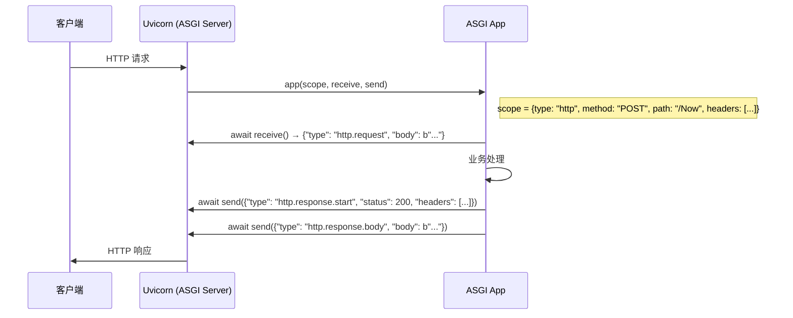

**ASGI 消息类型**：
- `http.response.start`：响应开始，包含 `status` 和 `headers`
- `http.response.body`：响应体，包含 `body` 和 `more_body`（是否还有后续 chunk）
- `http.request`：请求体，包含 `body` 和 `more_body`
- `http.disconnect`：连接断开
- `lifespan.startup` / `lifespan.shutdown`：应用生命周期事件

#### 7.4.2 Starlette 在 ASGI 之上的封装

Starlette 是 FastAPI 的底层框架，它在原始 ASGI 协议之上提供了更友好的抽象层：

```
┌─────────────────────────────────────────────────────────┐
│                    FastAPI (路由 + 数据校验)               │
├─────────────────────────────────────────────────────────┤
│              Starlette (请求/响应/中间件/路由)              │
├─────────────────────────────────────────────────────────┤
│            ASGI 协议 (scope / receive / send)             │
├─────────────────────────────────────────────────────────┤
│              Uvicorn (ASGI 服务器)                        │
└─────────────────────────────────────────────────────────┘
```

Starlette 的核心封装：

| 原始 ASGI | Starlette 封装 | 说明 |
|-----------|---------------|------|
| `scope["headers"]` | `Request.headers` | 从 `[(b"k", b"v"), ...]` 转为字典式访问 |
| `await receive()` | `await Request.body()` | 收集所有 body chunks 为完整 bytes |
| `await send(msg)` | `Response(content=...)` | 构造完整的 start + body 消息 |
| `scope["state"]` | `request.state.xxx` | 跨中间件传递数据 |
| 手动 send 拦截 | `BaseHTTPMiddleware.dispatch()` | 高级中间件抽象 |

#### 7.4.3 BaseHTTPMiddleware 的工作原理与局限

`BaseHTTPMiddleware` 是 Starlette 提供的**高级中间件基类**，让开发者能用 `Request`/`Response` 对象编写中间件，而无需直接操作原始 ASGI 消息：

```python
class MyMiddleware(BaseHTTPMiddleware):
    async def dispatch(self, request: Request, call_next) -> Response:
        # 前处理：拿到完整的 Request 对象
        request_id = request.headers.get("X-Request-ID", "")
        
        # 调用下一个中间件/handler
        response = await call_next(request)
        
        # 后处理：拿到完整的 Response 对象
        response.headers["X-Request-ID"] = request_id
        return response
```

**`BaseHTTPMiddleware` 内部机制**：

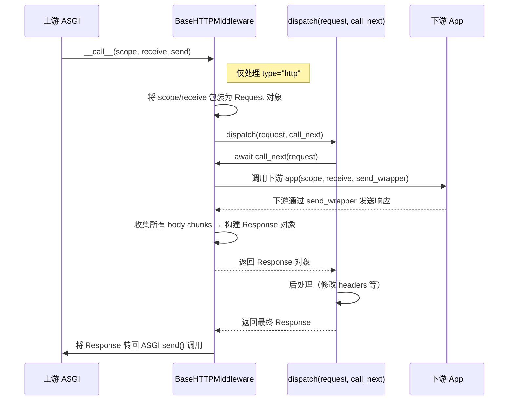

**`BaseHTTPMiddleware` 的已知缺陷**：

| 缺陷 | 说明 | 影响 |
|------|------|------|
| **body 一次性读取** | `call_next` 会将整个 response body 收集到内存 | 不支持真正的流式响应（StreamingResponse 失效） |
| **请求体消费** | `call_next` 内部可能消费 request body | 下游中间件/handler 可能读不到 body |
| **异常被吞** | 下游抛出的异常被 `call_next` 捕获，只返回 500 Response | 无法区分具体异常类型 |
| **OTel 不兼容** | OpenTelemetry `FastAPIInstrumentor` 会绕过 `dispatch()` | **本项目遇到的核心问题**（见下文） |

**`call_next` 的跨 Task 通信机制（源码级分析）**：

上述缺陷的根源在于 `BaseHTTPMiddleware` 内部 `call_next` 的实现。它使用 `anyio.create_task_group()` 和 `anyio.create_memory_object_stream()` 在**两个并发 task 之间传递消息**：

```python
# starlette/middleware/base.py（简化）
class BaseHTTPMiddleware:
    async def __call__(self, scope, receive, send):
        request = _CachedRequest(scope, receive)
        response_sent = anyio.Event()

        async def call_next(request):
            # 在新 task 中执行下游 app
            async def coro():
                with send_stream:
                    await self.app(scope, receive_or_disconnect, send_no_error)

            task_group.start_soon(coro)  # ← 启动新 Task（Task B）
            message = await recv_stream.receive()  # ← Task A 等待 Task B 通过 stream 发回响应
            ...

        # 使用 anyio 内存流在 task 间通信
        send_stream, recv_stream = anyio.create_memory_object_stream()

        async with anyio.create_task_group() as task_group:
            response = await self.dispatch_func(request, call_next)  # Task A
            await response(scope, wrapped_receive, send)
            response_sent.set()
```

执行流程：
- **Task A**（主 task）：执行 `dispatch(request, call_next)` → 开发者的业务逻辑
- **Task B**（由 `call_next` 内部的 `task_group.start_soon(coro)` 启动）：执行下游 `self.app(scope, receive, send_no_error)`
- **通信方式**：下游的响应通过 `send_stream` → `recv_stream` 从 Task B 传递到 Task A

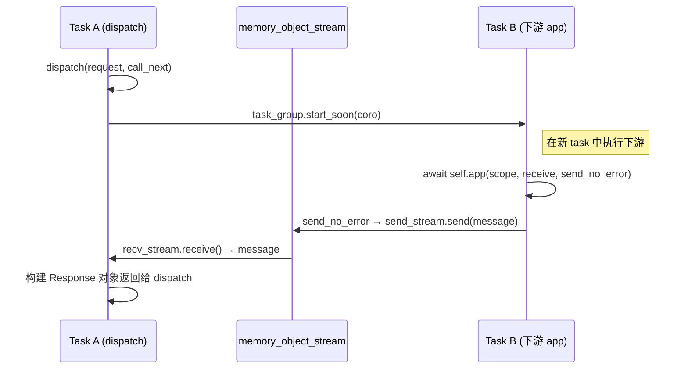

这种**跨 task 内存流通信**设计的隐含前提是：`send` 回调是同步、线性的，各 task 之间的同步语义（`response_sent` Event、`memory_object_stream`）不会被外部因素破坏。一旦 OTel 改变了中间件栈结构并在 `send`/`receive` 上添加了额外的异步包装层，这个前提就会被打破（详见 7.4.5）。

#### 7.4.4 纯 ASGI 中间件 vs BaseHTTPMiddleware

**纯 ASGI 中间件**直接实现 ASGI 接口，通过拦截 `send`/`receive` 回调来修改请求/响应：

```python
class MyASGIMiddleware:
    def __init__(self, app: ASGIApp):
        self.app = app

    async def __call__(self, scope, receive, send):
        if scope["type"] != "http":
            await self.app(scope, receive, send)
            return

        # 前处理：直接操作 scope（原始字典）
        headers = dict((k.decode(), v.decode()) for k, v in scope["headers"])
        request_id = headers.get("x-request-id", "")

        # 拦截 send 回调，修改响应
        async def send_wrapper(message):
            if message["type"] == "http.response.start":
                # 修改响应 headers
                ...
            await send(message)

        await self.app(scope, receive, send_wrapper)
```

**对比总结**：

| 方面 | BaseHTTPMiddleware | 纯 ASGI 中间件 |
|------|-------------------|---------------|
| **API 易用性** | ✅ `dispatch(request, call_next)` 非常简洁 | ❌ 需手动处理 `scope/receive/send`，代码量大 |
| **Request/Response 对象** | ✅ 自动封装，直接操作 | ❌ 需手动解析原始字典和字节 |
| **流式响应** | ❌ body 一次性读入内存 | ✅ 可逐 chunk 处理 |
| **异常传播** | ❌ 被 `call_next` 吞掉 | ✅ 正常向上冒泡 |
| **性能** | ⚠️ 额外的对象创建和转换开销 | ✅ 零额外开销 |
| **OTel 兼容性** | ❌ 与 `FastAPIInstrumentor` 冲突 | ✅ 完全兼容 |
| **代码量（以 RequestID 为例）** | ~30 行 | ~250 行 |

#### 7.4.5 本项目遇到的问题与解决方案

**问题现象**：

`RequestIDMiddleware` 最初继承 `BaseHTTPMiddleware` 实现，在**单独测试时完全正常**，但在 **tide 完整服务环境**中（启用了 OpenTelemetry），`dispatch()` 方法对 HTTP 请求不会被调用（仅 lifespan 事件触发了 `__call__`），导致：
1. response body 中 `RequestId` 字段为空（未被自动填充）
2. 日志中 request_id 显示为 `[-]`
3. X-Request-ID 响应头缺失

**根因分析（源码级深度剖析）**：

**① 原始中间件栈的构建过程**

Starlette 的 `build_middleware_stack()` 按洋葱模型**倒序包装**：

```python
# starlette/applications.py
middleware = (
    [Middleware(ServerErrorMiddleware, ...)]   # 最外层
    + self.user_middleware                     # ← RequestIDMiddleware 在这里
    + [Middleware(ExceptionMiddleware, ...)]   # 最内层
)
app = self.router
for cls, args, kwargs in reversed(middleware):
    app = cls(app, *args, **kwargs)           # 从内到外一层层包裹
return app
```

最终结构：`ServerErrorMiddleware → RequestIDMiddleware → ExceptionMiddleware → Router`

**② OTel `instrument_app()` 如何重组中间件栈**

`FastAPIInstrumentor.instrument_app()` 替换了 `build_middleware_stack`，新的方法会：

```python
# opentelemetry/instrumentation/fastapi/__init__.py（简化）
def build_middleware_stack(self):
    # Step 1: 调用原始 build_middleware_stack
    inner = self._original_build_middleware_stack()
    # inner = ServerErrorMiddleware → [用户中间件] → ExceptionMiddleware → Router

    # Step 2: 抽取 ServerErrorMiddleware 的内部 app
    exception_middleware = ExceptionHandlerMiddleware(inner.app)

    # Step 3: 创建新的 ServerErrorMiddleware
    error_middleware = ServerErrorMiddleware(app=exception_middleware, ...)

    # Step 4: 用 OpenTelemetryMiddleware 包裹
    otel_middleware = OpenTelemetryMiddleware(error_middleware, ...)

    # Step 5: 最外层再包一个 ServerErrorMiddleware
    return ServerErrorMiddleware(app=otel_middleware)
```

中间件栈对比：

```mermaid
graph TB
    subgraph "原始栈（无 OTel）"
        A1["ServerErrorMiddleware"] --> B1["RequestIDMiddleware\n(BaseHTTPMiddleware)"]
        B1 --> C1["ExceptionMiddleware"]
        C1 --> D1["Router"]
    end

    subgraph "OTel 改造后的栈"
        A2["ServerErrorMiddleware ②（新增）"] --> B2["OpenTelemetryMiddleware（纯 ASGI）"]
        B2 --> C2["ServerErrorMiddleware ①（原始, app 被替换）"]
        C2 --> D2["ExceptionHandlerMiddleware（OTel 新增）"]
        D2 --> E2["RequestIDMiddleware（BaseHTTPMiddleware）"]
        E2 --> F2["ExceptionMiddleware"]
        F2 --> G2["Router"]
    end
```

**③ OTel 如何打破 `BaseHTTPMiddleware` 的跨 Task 通信**

`OpenTelemetryMiddleware` 是纯 ASGI 中间件，它会**包装 `receive` 和 `send` 回调**添加追踪逻辑。当这些包装后的回调传递到 `BaseHTTPMiddleware` 的 `call_next` 内部时，跨 task 通信被破坏：

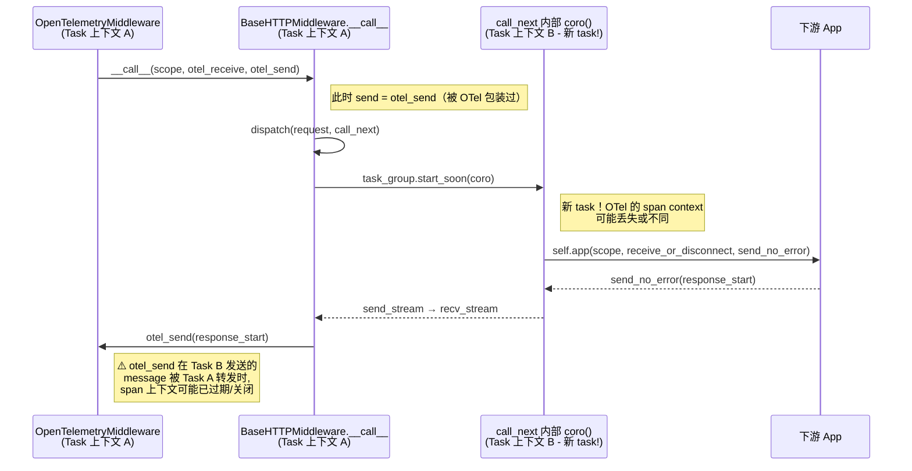

具体的三种破坏路径：

| 路径 | 机制 | 后果 |
|------|------|------|
| **路径 1：`anyio` 同步原语竞态** | OTel 在 `send` 回调中做异步操作时，`response_sent` Event 和 `memory_object_stream` 之间的时序被打乱。如果 `recv_stream` 已关闭，`send_no_error` 内部的 `BrokenResourceError` 处理会静默丢弃消息 | 响应被丢弃 |
| **路径 2：中间件栈重建时机** | OTel 替换 `build_middleware_stack` 后，`RequestIDMiddleware` 的 `self.app` 指向的下游链路被拉长（插入了 ExceptionHandlerMiddleware → ServerErrorMiddleware → OTelMiddleware），`call_next` 内部用 `task_group.start_soon` 执行这条更长的链路时，任务间同步语义可能失效 | dispatch 不被正确触发 |
| **路径 3（最可能）：`_CachedRequest` 的 receive 被替换** | `BaseHTTPMiddleware` 用 `_CachedRequest(scope, receive)` 创建请求对象，此时 `receive` 是 OTel 包装过的 `otel_receive`。`call_next` 内部的 `receive_or_disconnect` 中，`wrapped_receive`（调用 `otel_receive`）和 `response_sent.wait` 在 `anyio.create_task_group` 中竞争，OTel 的额外异步操作导致返回 `{"type": "http.disconnect"}`，下游认为客户端断开不发送响应 | dispatch 拿不到 Response |

**④ 为什么纯 ASGI 实现不受影响**

```python
# 纯 ASGI 中间件的核心逻辑
class RequestIDMiddleware:
    async def __call__(self, scope, receive, send):
        async def send_wrapper(message):
            await send(message)  # ← 直接转发，没有 task_group，没有 memory_stream
        await self.app(scope, receive, send_wrapper)  # ← 单线程、线性执行
```

| 方面 | BaseHTTPMiddleware | 纯 ASGI |
|------|-------------------|--------|
| 内部通信 | `anyio.create_task_group` + `memory_object_stream` 跨 task | 单一调用栈，线性 `await` |
| OTel 包装 `send/receive` | 在跨 task 转发时引发竞态/上下文丢失 | 直接透传，不受影响 |
| 中间件栈重建 | `self.app` 指向的链路被拉长，`call_next` 内部同步语义失效 | 无状态包装，`self.app` 指谁都能正常 `await` |
| 核心原因 | **把线性调用链拆成两个并发 task 间的消息传递，OTel 改变栈结构后暴露竞态** | **保持 ASGI 原始调用约定：谁调你就 await 谁** |

**解决方案**：

将 `RequestIDMiddleware` 改为**纯 ASGI 实现**，不依赖 `BaseHTTPMiddleware`：

```python
# 改造前（BaseHTTPMiddleware，~30 行但与 OTel 不兼容）
class RequestIDMiddleware(BaseHTTPMiddleware):
    async def dispatch(self, request, call_next):
        request_id = request.headers.get("X-Request-ID") or str(uuid.uuid4())
        response = await call_next(request)
        # 修改 response body ...
        return response

# 改造后（纯 ASGI，~250 行但完全兼容）
class RequestIDMiddleware:
    async def __call__(self, scope, receive, send):
        # 从 scope["headers"] 解析 request_id
        # 通过 send_wrapper 拦截并修改响应
        # 使用 contextvars 跨层传播
        await self.app(scope, receive, send_wrapper)
```

**改造要点**：

| 改造点 | 说明 |
|--------|------|
| 不继承 `BaseHTTPMiddleware` | 直接实现 `__call__(scope, receive, send)` |
| 拦截 `send` 回调 | 缓存 `http.response.start`，收集所有 body chunks，在最后一个 chunk 时注入 request_id |
| 存储到 `scope["state"]` | 让下游 `BaseHTTPMiddleware` 子类仍可通过 `request.state.request_id` 获取 |
| 存储到 `contextvars` | 通过 `RequestContext.scope()` 上下文管理器设置，确保日志 Formatter 可读取 |
| 双重获取策略 | 下游中间件（如 `LoggerMiddleware`）同时支持 `request.state.request_id` 和 `contextvars` 获取，确保至少有一种方式能拿到 |

**影响范围**：

当前项目中仅 `RequestIDMiddleware` 改为了纯 ASGI 实现，其余中间件（`LoggerMiddleware`、`HttpTimerMiddleware`、`RecoveryMiddleware` 等）仍保持 `BaseHTTPMiddleware` 实现。它们能正常工作的原因是：
- 它们不需要在 OTel instrument 之前执行
- OTel 的 `FastAPIInstrumentor` 对中间件栈的影响主要体现在最外层（最先执行的）中间件上
- `RequestIDMiddleware` 作为最外层中间件，改为纯 ASGI 后，为下游中间件正确设置了 `scope["state"]` 和 `contextvars`，保证了数据传递链路的完整性

### 7.5 延迟导入策略

`peek.net.grpc` 和 `peek.net.webserver` 使用延迟导入（`__getattr__`），避免：
- 未安装 gRPC 依赖时导入报错
- 循环依赖问题
- 不必要的初始化开销