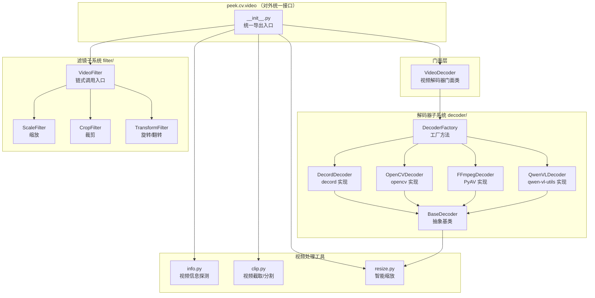
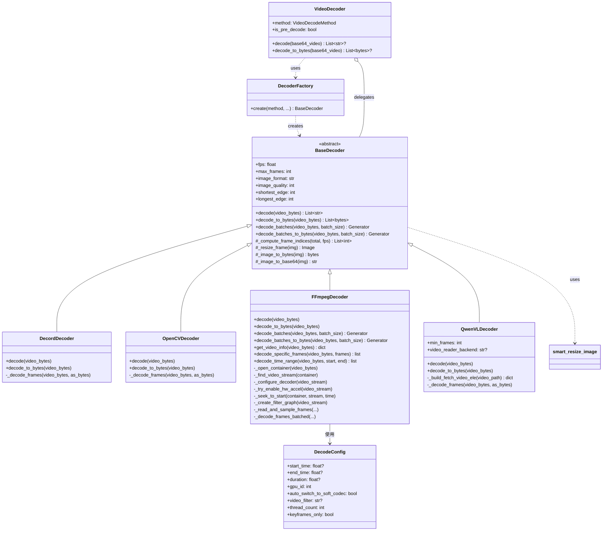
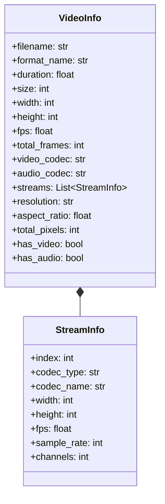

# Peek Video 模块设计文档

## 1. 概述

Peek Video 模块（`peek.cv.video`）是一套 Python 视频处理工具集，从 [kingfisher](https://github.com/kaydxh/kingfisher)（C++ FFmpeg 封装库）迁移而来。它将 kingfisher 中高频使用的上层功能用 Python 生态工具重新实现，保持概念对等的同时充分利用 Python 生态的简洁性。

### 1.1 设计背景

- **kingfisher**（C++ 版本）：完整的 FFmpeg C++ 封装库，共 25+ 个文件，涵盖输入/输出文件、滤镜系统、硬件加速、流管理等底层能力
- **peek**（Python 版本）：从 kingfisher 中提取高频使用的功能子集，用 Python 生态工具（ffmpeg-python / PyAV / decord / opencv）重新实现

### 1.2 设计原则

| 原则 | 说明 |
|------|------|
| **YAGNI** | 只迁移实际需要的功能，不过度设计 |
| **按功能分模块** | 按功能而非底层库来组织代码结构 |
| **策略模式** | 仅对需要多种实现的功能（解码器）使用子文件夹 + 策略模式 |
| **接口简洁** | 通过 `__init__.py` 统一导出，用户无需感知底层实现 |
| **向后兼容** | 重构过程中保持对外接口不变，调用方无需修改 |

---

## 2. 架构设计

### 2.1 整体架构图



### 2.2 目录结构

```
peek/cv/video/
├── __init__.py              # 统一导出入口
├── video_decoder.py         # VideoDecoder 门面类（向后兼容）
├── resize.py                # 智能缩放（Qwen2-VL 兼容）
├── info.py                  # 视频信息探测（ffprobe / opencv）
├── clip.py                  # 视频截取/分割（ffmpeg-python API）
├── decoder/                 # 解码器子包（策略模式）
│   ├── __init__.py          # 导出所有解码器
│   ├── base.py              # BaseDecoder 抽象基类
│   ├── decord_decoder.py    # DecordDecoder（推荐，性能最好）
│   ├── opencv_decoder.py    # OpenCVDecoder（兼容性好）
│   ├── ffmpeg_decoder.py    # FFmpegDecoder（功能最完整）
│   ├── qwenvl_decoder.py   # QwenVLDecoder（与 Qwen3-VL 预处理完全一致）
│   └── factory.py           # DecoderFactory 工厂方法
└── filter/                  # 滤镜子包
    ├── __init__.py           # 导出所有滤镜
    ├── video_filter.py       # VideoFilter 链式调用入口
    ├── scale.py              # ScaleFilter 缩放
    ├── crop.py               # CropFilter 裁剪
    └── transform.py          # TransformFilter 旋转/翻转
```

### 2.3 为什么不按底层库分文件夹？

在设计阶段讨论了两种方案：

| 方案 | 组织方式 | 优点 | 缺点 |
|------|---------|------|------|
| **方案 A** | 按底层库分文件夹（ffmpeg/、decord/、opencv/） | 底层实现隔离 | 目录层级深，大部分功能只有单一实现，过度设计 |
| **方案 B ✅** | 按功能分文件，仅解码器用子文件夹 | 符合 YAGNI 原则，导入简洁 | 未来多实现时需重构（但成本低） |

**最终选择方案 B**，理由：
- 解码器确实有 decord / opencv / ffmpeg / qwenvl 四种实现 → 单独建子文件夹 + 策略模式
- 滤镜、截取、信息探测目前只需要一种最佳实现（ffmpeg）→ 直接放文件
- 对外接口简洁：`from peek.cv.video import VideoDecoder` 而非 `from peek.cv.video.decoder.decord_decoder import DecordDecoder`

---

## 3. 模块详细设计

### 3.1 解码器子系统（decoder/）

#### 类关系图



#### 五种解码器对比

| 特性 | DecordDecoder | OpenCVDecoder | FFmpegDecoder | QwenVLDecoder |
|------|:---:|:---:|:---:|:---:|
| 性能 | ⭐⭐⭐ | ⭐⭐ | ⭐⭐⭐ | ⭐⭐ |
| 格式兼容性 | ⭐⭐ | ⭐⭐ | ⭐⭐⭐ | ⭐⭐ |
| 与 Qwen3-VL 预处理一致性 | ⭐⭐（对齐） | ⭐⭐（对齐） | ⭐⭐（对齐） | ⭐⭐⭐（100% 一致） |
| GPU 硬件加速 | ❌ | ❌ | ✅ | ❌ |
| 精确 Seek | ❌ | ❌ | ✅ | ❌ |
| 视频滤镜 | ❌ | ❌ | ✅ | ❌ |
| 时间段截取 | ❌ | ❌ | ✅ | ❌ |
| 流式批量读帧 | ✅ | ✅ | ✅（真正流式） | ✅（全量分批） |
| 进度回调/取消 | ❌ | ❌ | ✅ | ❌ |
| 内存直接读取 | ✅ | ❌ | ✅ | ❌（需临时文件） |
| resize 方式 | LANCZOS | LANCZOS | LANCZOS | BICUBIC（torchvision） |
| 帧采样逻辑 | peek 自实现（对齐 Qwen3-VL） | peek 自实现（对齐 Qwen3-VL） | peek 自实现（对齐 Qwen3-VL） | 官方 smart_nframes |
| 依赖库 | decord | opencv-python | av (PyAV) | torch, torchvision, qwen-vl-utils |

#### kingfisher → FFmpegDecoder 功能映射

| kingfisher (C++) | FFmpegDecoder (Python) | 说明 |
|---|---|---|
| `InputFile::open()` | `_open_container()` | 打开视频容器，支持内存/临时文件 |
| `add_input_streams()` | `_find_video_stream()` + `_configure_decoder()` | 查找视频流 + 配置解码器 |
| `InputFile::seek()` | `_seek_to_start()` | 精确 seek 到指定时间 |
| `InputFile::read_frames()` + `decode_video()` | `_read_and_sample_frames()` | 逐帧解码 + 采样（全量模式） |
| `InputFile::read_frames(batch_size)` 循环 | `decode_batches(batch_size)` | 流式批量读帧（迭代器模式） |
| `send_frame_to_filters()` | `_create_filter_graph()` | 视频滤镜支持 |
| `get_duration/get_frame_rate/get_total_frames` | 对应的 `_get_*` 方法 | 视频元信息获取 |
| `gpu_id_` + `auto_switch_to_soft_codec_` | `_try_enable_hw_accel()` | GPU 硬件加速 |
| `progress_callback_` + `cancel_callback_` | `progress_callback` + `cancel_callback` | 进度回调与取消机制 |

### 3.2 视频信息探测（info.py）

提供 `probe()` 函数和 `VideoInfo`/`StreamInfo` 数据类，对应 kingfisher `InputFile` 的信息获取方法。

**支持两种后端**：
- `ffprobe`（默认）：使用 `ffmpeg-python` 的 `ffmpeg.probe()` API，信息最全面
- `opencv`：使用 OpenCV，无需 ffmpeg 依赖

**数据类层次**：



### 3.3 视频截取（clip.py）

提供 `VideoClip` 类，对应 kingfisher `InputFile::seek` + `OutputFile::write_frames` 的组合操作。

**功能**：
- `cut()` — 按起止时间或起始时间+时长截取视频片段，支持精确/快速两种模式
- `split()` — 将视频按固定时长分割为多个片段

**底层实现**：使用 `ffmpeg-python` 的 `ffmpeg.input().output().run()` 链式 API（非 subprocess 命令行调用）。

### 3.4 滤镜子系统（filter/）

对应 kingfisher `FilterBuilder` 的链式 API。

**模块组成**：

| 模块 | 对应 kingfisher | 功能 |
|------|----------------|------|
| `VideoFilter` | `FilterBuilder` 链式 API | 链式调用入口，组合多个滤镜后一次性执行 |
| `ScaleFilter` / `ScaleConfig` | `FilterBuilder::scale` / `ScaleConfig` | 视频缩放（指定宽高、保持比例、偶数对齐） |
| `CropFilter` / `CropConfig` | `FilterBuilder::crop` / `CropConfig` | 视频裁剪（坐标、居中、按宽高比） |
| `TransformFilter` / `TransformConfig` | `FilterBuilder::transform` / `TransformConfig` | 旋转/翻转（任意角度、90°转置、水平/垂直翻转） |

**滤镜流水线**：


**底层实现**：所有滤镜模块均使用 `ffmpeg-python` API（非 subprocess 命令行调用），通过 `ffmpeg.input().output(vf=filter_chain).run()` 一次性执行。

### 3.5 智能缩放（resize.py）

提供 `smart_resize()` 和 `smart_resize_image()` 函数，实现与 Qwen2-VL/Qwen3-VL 视觉预处理器一致的分辨率控制逻辑：

1. 如果像素总数超过 `max_pixels`（longest_edge），按比例缩小
2. 如果像素总数低于 `min_pixels`（shortest_edge），按比例放大
3. 宽高对齐到 `patch_size`（28）的倍数

### 3.6 帧重新编码为视频（VideoDecoder.encode_frames_to_video）

提供静态方法 `encode_frames_to_video()` 和实例方法 `decode_to_video()`，将预解码的帧图片重新编码为 H.264 mp4 视频。

**设计背景**：当使用预解码模式（decord/opencv/ffmpeg/qwenvl）时，如果以多个 `image_url` 方式传入 vLLM，Qwen3-VL 模型会将其当作**独立图片**处理（没有 temporal position embedding）。而以 `video_url` 方式传入时，模型能正确理解帧间的时序关系。因此需要将预解码帧重新编码为 mp4 视频。

**关键设计**：
- 通过 PTS（Presentation Timestamp）精确控制帧的时间位置
- 帧间隔 = `1 / target_fps`，确保下游以 `target_fps` 重新采样时恰好取到所有帧
- 使用 CRF=0 无损编码 + ultrafast preset，减少画质损失
- 编码器内部帧率设为 30fps（仅影响 time_base 精度），实际帧间隔通过 PTS 控制

```python
# 静态方法 — 可独立使用
video_b64 = VideoDecoder.encode_frames_to_video(
    frames_b64=frames,
    target_fps=0.5,  # vLLM 的采样 fps
)

# 实例方法 — decode + encode 组合
vd = VideoDecoder(method="decord", fps=0.5)
video_b64 = vd.decode_to_video(base64_video, target_fps=0.5)
```

---

## 4. 依赖关系

### 4.1 Python 依赖

| 库 | 版本 | 用途 | 安装方式 |
|----|------|------|---------|
| `ffmpeg-python` | ≥0.2.0 | 视频信息探测、截取、滤镜（ffprobe/ffmpeg API） | `pip install peek[cv]` |
| `av` (PyAV) | ≥10.0.0 | FFmpegDecoder 底层解码（FFmpeg C API 绑定） | `pip install peek[cv]` |
| `opencv-python` | ≥4.8.0 | OpenCVDecoder、opencv 信息探测后端 | `pip install peek[cv]` |
| `decord` | — | DecordDecoder（高性能解码） | `pip install decord` |
| `qwen-vl-utils` | — | QwenVLDecoder（Qwen3-VL 预处理） | `pip install qwen-vl-utils` |
| `torch` | — | QwenVLDecoder 依赖 | `pip install torch` |
| `torchvision` | — | QwenVLDecoder 依赖 | `pip install torchvision` |
| `Pillow` | — | 图片格式转换、缩放 | 核心依赖 |

### 4.2 系统依赖

- **FFmpeg**：需要系统安装 ffmpeg 和 ffprobe（`ffmpeg-python` 和 `av` 的底层依赖）

---

## 5. 功能优先级与迁移计划

### 5.1 从 kingfisher 迁移的功能

| 优先级 | 功能 | 状态 | 说明 |
|:------:|------|:----:|------|
| P0 | 视频解码（抽帧） | ✅ 已完成 | 支持 decord / opencv / ffmpeg / qwenvl 四种后端 |
| P0 | 智能缩放 | ✅ 已完成 | Qwen2-VL 兼容的 smart_resize |
| P0 | 视频信息获取 | ✅ 已完成 | 时长、帧率、分辨率、编码格式等 |
| P0 | 视频截取/分割 | ✅ 已完成 | 按时间段裁剪、固定时长分割 |
| P0 | 视频缩放 | ✅ 已完成 | ScaleFilter |
| P0 | 视频裁剪 | ✅ 已完成 | CropFilter（坐标/居中/宽高比） |
| P0 | 视频旋转/翻转 | ✅ 已完成 | TransformFilter |
| P1 | 水印叠加 | 📋 计划中 | 对应 FilterBuilder::add_watermark |
| P1 | 文字叠加 | 📋 计划中 | 对应 FilterBuilder::add_text |
| P1 | 视频拼接 | 📋 计划中 | 对应 ConcatConfig |
| P1 | 颜色调整 | 📋 计划中 | 亮度/对比度/饱和度 |
| P1 | 填充/边框 | 📋 计划中 | 对应 FilterBuilder::pad |
| P2 | GPU 硬件加速 (CUDA/NVENC) | ⚠️ 部分支持 | FFmpegDecoder 支持 NVDEC 解码 |
| P2 | 底层流管理 | ❌ 不迁移 | Python 层无需直接操作 |
| P2 | 复杂滤镜管线 | ❌ 不迁移 | ffmpeg-python 已封装 |
| P2 | 底层 AVPacket/AVFrame | ❌ 不迁移 | Python 层不需要 |

### 5.2 不迁移的功能及原因

| 功能 | 原因 |
|------|------|
| GPU 硬件编码 (NVENC) | Python 中直接绑定 FFmpeg CUDA 编码比较困难，且性能瓶颈通常不在编码 |
| 底层 Stream/Packet 管理 | 过于底层，`ffmpeg-python` 和 `av` 已封装 |
| 复杂滤镜图管线 | 直接使用 `ffmpeg-python` 的 filter chain 更简洁 |
| 区域模糊 | 使用频率低，需要时可用 opencv 直接实现 |

---

## 6. 使用示例

### 6.1 视频解码（抽帧）

```python
from peek.cv.video import VideoDecoder

# 方式1: vllm 模式（不预解码，直接传视频给 vLLM）
vd = VideoDecoder(method="vllm")
result = vd.decode(base64_video)  # 返回 None

# 方式2: decord 模式（推荐，性能最好）
vd = VideoDecoder(method="decord", fps=1.0, max_frames=10)
frames = vd.decode(base64_video)  # List[str] - base64 帧图片列表

# 方式3: ffmpeg 模式（功能最完整）
from peek.cv.video import DecodeConfig
config = DecodeConfig(start_time=10.0, end_time=30.0, gpu_id=0)
vd = VideoDecoder(method="ffmpeg", fps=1.0, decode_config=config)
frames = vd.decode(base64_video)

# 方式4: qwenvl 模式（与 Qwen3-VL 预处理 100% 一致）
vd = VideoDecoder(method="qwenvl", fps=0.5)
frames = vd.decode(base64_video)  # 使用 qwen-vl-utils 的 smart_nframes + smart_resize

# 方式5: 预解码后重新编码为 mp4 视频（保持 temporal position embedding）
vd = VideoDecoder(method="decord", fps=0.5)
video_b64 = vd.decode_to_video(base64_video, target_fps=0.5)  # 返回 mp4 视频 base64

# 方式6: 将帧列表重新编码为 mp4 视频（静态方法，可独立使用）
frames = vd.decode(base64_video)
video_b64 = VideoDecoder.encode_frames_to_video(frames, target_fps=0.5)

# 带智能缩放
size = {"shortest_edge": 196608, "longest_edge": 524288}
vd = VideoDecoder(method="decord", fps=0.5, size=size)
frames = vd.decode(base64_video)
```

### 6.2 视频信息探测

```python
from peek.cv.video import probe

# 使用 ffprobe 后端（默认）
info = probe("input.mp4")
print(f"时长: {info.duration}s")
print(f"分辨率: {info.resolution}")
print(f"帧率: {info.fps} fps")
print(f"总帧数: {info.total_frames}")
print(f"视频编码: {info.video_codec}")
print(f"音频编码: {info.audio_codec}")

# 使用 opencv 后端
info = probe("input.mp4", backend="opencv")
```

### 6.3 视频截取

```python
from peek.cv.video import VideoClip

# 按时间段截取
VideoClip.cut("input.mp4", "output.mp4", start=10.0, end=30.0)

# 精确截取 vs 快速截取
VideoClip.cut("input.mp4", "output.mp4", start=5.0, duration=10.0, accurate=True)
VideoClip.cut("input.mp4", "output.mp4", start=5.0, duration=10.0, accurate=False)

# 视频分割
segments = VideoClip.split("input.mp4", "./segments/", segment_duration=10.0)
```

### 6.4 链式滤镜

```python
from peek.cv.video import VideoFilter

# 链式调用
VideoFilter("input.mp4") \
    .scale(1280, 720) \
    .crop(center_crop=True, out_width=640, out_height=480) \
    .rotate(90) \
    .hflip() \
    .output("output.mp4")

# 单独使用某个滤镜
from peek.cv.video import ScaleFilter, CropFilter, TransformFilter

ScaleFilter.apply("input.mp4", "output.mp4", width=1280, height=720)
CropFilter.apply("input.mp4", "output.mp4", center_crop=True, out_width=640, out_height=480)
TransformFilter.apply("input.mp4", "output.mp4", rotation_angle=90)
```

### 6.5 FFmpegDecoder 扩展功能

```python
from peek.cv.video import FFmpegDecoder, DecodeConfig

# 获取视频信息
decoder = FFmpegDecoder()
info = decoder.get_video_info(video_bytes)
# {'duration': 60.0, 'total_frames': 1800, 'frame_rate': 30.0, ...}

# 解码指定帧号
frames = decoder.decode_specific_frames(video_bytes, frame_numbers=[0, 10, 50, 100])

# 解码指定时间范围
frames = decoder.decode_time_range(video_bytes, start_time=5.0, duration=10.0)

# GPU 硬件加速 + 视频滤镜
config = DecodeConfig(
    gpu_id=0,
    video_filter="scale=1280:720",
    keyframes_only=True,
)
decoder = FFmpegDecoder(fps=1.0, decode_config=config)
frames = decoder.decode(video_bytes)
```

### 6.6 流式批量读帧（decode_batches）

对应 kingfisher `InputFile::read_frames(batch_size)` 的循环模式。
每次 yield 一批帧（最多 batch_size 个），内存占用恒定，适合处理超长视频。

```python
from peek.cv.video import FFmpegDecoder, DecodeConfig

# kingfisher C++ 模式:
# while (!finished) {
#     video_frames.clear();
#     input_file.read_frames(video_frames, audio_frames, 8, finished);
#     // 处理 video_frames...
# }

# peek Python 等价写法:
decoder = FFmpegDecoder(fps=0, max_frames=-1)  # 全帧解码
for batch in decoder.decode_batches(video_bytes, batch_size=8):
    print(f"本批 {len(batch)} 帧")
    for frame_base64 in batch:
        process_frame(frame_base64)

# 字节输出模式
for batch in decoder.decode_batches_to_bytes(video_bytes, batch_size=8):
    for frame_bytes in batch:
        save_frame(frame_bytes)

# 配合时间范围 + 采样
config = DecodeConfig(start_time=10.0, duration=30.0)
decoder = FFmpegDecoder(fps=1.0, max_frames=50, decode_config=config)
for batch in decoder.decode_batches(video_bytes, batch_size=10):
    analyze_batch(batch)

# 三种解码器都支持 decode_batches
from peek.cv.video import DecordDecoder, OpenCVDecoder

# DecordDecoder
for batch in DecordDecoder(fps=1.0).decode_batches(video_bytes, batch_size=5):
    print(len(batch))

# OpenCVDecoder
for batch in OpenCVDecoder(fps=1.0).decode_batches(video_bytes, batch_size=5):
    print(len(batch))
```

#### kingfisher → peek 批量读帧对照表

| kingfisher (C++) | peek (Python) | 说明 |
|---|---|---|
| `read_frames(video, audio, 8, finished)` | `decode_batches(video_bytes, batch_size=8)` | 每次读取一批帧 |
| `while (!finished)` 循环 | `for batch in decode_batches()` | 迭代直到视频结束 |
| `finished = true` | 迭代器自动耗尽 | 无需手动检查结束标志 |
| `video_frames.clear()` | 自动管理（每次 yield 新 list） | 无需手动清空缓冲区 |
| `AVERROR_EXIT`（取消） | `cancel_callback` 返回 True | 提前终止迭代 |

---

## 7. 单元测试

测试文件位于 `tests/unit/` 目录下，共 **6 个测试文件**、**177+ 个测试用例**（177 passed + 6 skipped）。

| 测试文件 | 测试模块 | 用例数 | 覆盖内容 |
|---------|---------|:------:|--------|
| `test_video_resize.py` | `resize.py` | 13 | smart_resize 尺寸计算、smart_resize_image 图片缩放、边界情况 + 真实帧缩放 |
| `test_video_decoder.py` | `decoder/*` | 62+ | BaseDecoder 属性/帧索引/图片转换/批量读帧默认实现、Qwen3-VL 采样一致性验证、DecoderFactory 创建、DecodeConfig + 真实视频解码（decord/opencv/ffmpeg）+ 流式批量读帧 + 解码器一致性对比 |
| `test_video_facade.py` | `video_decoder.py` | 30+ | VideoDecodeMethod 枚举、vllm 模式、属性 + TestEncodeFramesToVideo（7 个用例：基本编码/单帧/空帧异常/自定义参数/不同尺寸/可解码验证）+ decode_to_video 集成测试 + 真实视频门面类测试 |
| `test_video_info.py` | `info.py` | 32 | 工具函数、StreamInfo/VideoInfo 数据类、流解析、probe 入口 + 真实视频 ffprobe/opencv 探测及一致性对比 |
| `test_video_clip.py` | `clip.py` | 9 | VideoClip.cut 参数校验 + 真实视频截取/分割 |
| `test_video_filter.py` | `filter/*` | 38 | ScaleFilter/CropFilter/TransformFilter 构建、VideoFilter 链式调用 + 真实视频滤镜（缩放/裁剪/旋转/链式组合） |

### 测试策略

采用**混合测试策略**，兼顾快速反馈与端到端覆盖：

- **纯逻辑 mock 测试**：保留数据类默认值、工具函数（`_safe_float`/`_parse_rational` 等）、枚举映射、异常路径等纯逻辑测试，使用 `unittest.mock` 隔离外部依赖
- **真实视频集成测试**：使用 `tests/testdata/bodyhead.text.mp4` 真实视频文件，测试所有端到端流程，标记 `@pytest.mark.integration`
- **依赖自动检测**：通过 `conftest.py` 中的 `skip_no_*` 标记自动检测依赖（decord/opencv/av/ffmpeg CLI），缺失依赖时 graceful skip
- **选择性运行**：只跑纯逻辑测试 `pytest tests/unit/ -m "not integration"`，全量运行 `pytest tests/unit/`

### 测试重构历程

1. **初始版本**：133 个纯 mock 单元测试
2. **集成真实测试**：将 `tests/integration/test_video_real.py` 中的集成用例合并到 unit 文件中
3. **删除低价值 mock**：移除 8 个

---

## 8. 技术决策记录

### 8.1 ffmpeg-python API vs subprocess 命令行

**决策**：统一使用 `ffmpeg-python` API，彻底移除 `subprocess` 调用。

**原因**：
- API 调用更 Pythonic，类型安全
- 统一错误处理（`ffmpeg.Error` 异常）
- 无需管理 ffmpeg 可执行文件路径
- 更易于测试（可 mock）

**改造范围**：
- `info.py`：`subprocess.run(ffprobe ...)` → `ffmpeg.probe()`
- `clip.py`：`subprocess.run(ffmpeg ...)` → `ffmpeg.input().output().run()`
- `filter/*.py`：`subprocess.run(...)` → `ffmpeg.input().output(vf=...).run()`

### 8.2 FFmpegDecoder 使用 PyAV 而非 ffmpeg-python

**决策**：FFmpegDecoder 使用 `av`（PyAV）库而非 `ffmpeg-python`。

**原因**：
- PyAV 是 FFmpeg C API 的直接 Python 绑定，提供帧级别的细粒度控制
- 支持 GPU 硬件加速（CUDA/NVDEC）
- 支持精确 seek、视频滤镜图
- 支持从内存直接读取视频（无需临时文件）
- `ffmpeg-python` 本质上还是生成 ffmpeg 命令行，不适合帧级操作

### 8.3 VideoDecoder 门面模式

**决策**：保留 `VideoDecoder` 作为门面类，内部委托给具体解码器。

**原因**：
- 保持对外接口向后兼容（tide 项目中 `from peek.cv.video import VideoDecoder` 无需修改）
- 统一 base64 编解码的封装（外部传入 base64，内部转为 bytes 后调用具体解码器）
- 支持 `vllm` 模式（不预解码，返回 None）

### 8.4 新增 QwenVLDecoder（基于 qwen-vl-utils）

**决策**：新增 `QwenVLDecoder`，直接调用 Qwen3-VL 官方 `qwen-vl-utils` 库的 `fetch_video()` 实现视频解码。

**原因**：
- 即使 peek 已对齐 Qwen3-VL 的帧采样算法（round + FRAME_FACTOR 对齐 + linspace），resize 环节仍有差异：peek 使用 PIL 的 LANCZOS，而 Qwen3-VL 官方使用 torchvision 的 BICUBIC
- 对于追求**与 Qwen3-VL 100% 一致**的场景，直接使用官方库是最可靠的方式
- QwenVLDecoder 可作为基准（baseline），用于验证其他解码器的对齐程度

**权衡**：QwenVLDecoder 需要额外安装 `torch`、`torchvision`、`qwen-vl-utils` 依赖，不如 decord/ffmpeg 轻量

### 8.5 预解码帧重新编码为 mp4 视频（input_mode=video）

**决策**：当 `input_mode=video` 时，将预解码帧通过 PyAV 重新编码为 H.264 mp4 视频，以 `video_url`（data URI）方式传入 vLLM。

**原因**：
- Qwen3-VL 使用 **3D RoPE**（旋转位置编码），以 `video_url` 传入时帧之间有 **temporal position embedding**（时间维度编码），模型能理解帧间的运动、变化和因果关系
- 以多个 `image_url` 传入时，模型将其视为独立图片，没有时序信息，影响视频理解效果
- vLLM 的 OpenAI 兼容 API 不支持 `type: video` 格式，只能通过 `video_url` 传入视频

**关键设计**：
- 使用 CRF=0 无损编码 + ultrafast preset，最小化画质损失
- 通过 PTS 精确控制帧间隔（`1/target_fps`），确保 vLLM 重新采样时恰好取到所有帧
- 编码器内部帧率设为 30fps（仅影响 time_base 精度），实际帧间隔由 PTS 控制

---

## 9. 开发过程问题总结

以下记录了 Video 模块开发过程中遇到的典型问题，包括问题现象、根因分析和最终解决方案。

### 9.1 ffmpeg subprocess 调用改为 API 调用

| 项目 | 内容 |
|------|------|
| **问题** | 初始 `clip.py` 和 `filter/*.py` 使用 `subprocess.run()` 直接调用 ffmpeg 命令行，不够 Pythonic，且难以进行错误处理和测试 |
| **原因** | 最初实现时直接从 kingfisher 的 C++ 命令行调用模式迁移过来，没有利用 Python 生态的封装 |
| **解决** | 统一改为 `ffmpeg-python` API 调用：`info.py` 用 `ffmpeg.probe()`，`clip.py` 用 `ffmpeg.input().output().run()`，`filter/*.py` 用 `ffmpeg.input().output(vf=filter_chain).run()`。FFmpegDecoder 则使用 `av`（PyAV）库实现帧级别控制 |

### 9.2 peek 模块中视频解码器新增 FFmpeg(PyAV) 实现

| 项目 | 内容 |
|------|------|
| **问题** | 原有 decord 和 opencv 解码器功能有限，不支持 GPU 硬件加速、精确 seek、视频滤镜、时间段截取等高级功能 |
| **原因** | decord/opencv 的 Python 绑定只提供基本的帧读取能力，无法映射 kingfisher `InputFile` 的完整功能集 |
| **解决** | 基于 `av`（PyAV）库新增 `FFmpegDecoder`，参考 kingfisher `InputFile` 的逻辑实现了：内存直接读取、GPU 硬件加速（NVDEC + 软件降级）、精确 seek、视频滤镜图、关键帧解码、进度回调/取消机制、指定帧号解码等完整功能 |

### 9.3 集成测试依赖缺失导致大量用例被跳过

| 项目 | 内容 |
|------|------|
| **问题** | 运行 `tests/integration/test_video_real.py` 时，37 个用例中有 24 个被 SKIPPED，只有 13 个通过。跳过原因包括：`ffprobe CLI 未安装`、`opencv-python 未安装`、`decord 未安装`、`ffmpeg CLI 未安装` |
| **原因** | 开发环境中未安装完整的视频处理依赖链。`decord` 在 macOS arm64 上没有预编译的 pip wheel；`ffmpeg`/`ffprobe` CLI 未通过系统包管理器安装；`opencv-python` 未安装 |
| **解决** | 逐一安装缺失依赖：`pip install opencv-python-headless`（opencv）、`brew install ffmpeg`（含 ffmpeg/ffprobe CLI）。`decord` 因 macOS arm64 无预编译包且 conda SSL 不通，暂时保持跳过。最终 31 passed + 6 skipped（全部为 decord 相关） |

### 9.4 使用真实视频文件进行端到端测试验证

| 项目 | 内容 |
|------|------|
| **问题** | 初期仅有 mock 单元测试，无法验证真实视频的解码、截取、滤镜等功能是否正确工作 |
| **原因** | 测试用例全部使用 `unittest.mock` 模拟外部依赖，只验证调用链而非实际功能 |
| **解决** | 使用 `tests/testdata/bodyhead.text.mp4` 真实视频文件编写集成测试，覆盖：ffprobe/opencv 信息探测及一致性对比、三种解码器（decord/opencv/ffmpeg）的基本解码/字节输出/缩放解码、FFmpegDecoder 的时间范围/滤镜/关键帧/进度回调/取消等高级功能、VideoClip 截取/分割、VideoFilter 缩放/裁剪/旋转/链式组合、smart_resize 真实帧缩放 |

### 9.5 集成测试用例合并到 unit 测试目录

| 项目 | 内容 |
|------|------|
| **问题** | 真实视频测试用例单独放在 `tests/integration/test_video_real.py`，与 unit 测试分离，运行和维护不便 |
| **原因** | 初期为了隔离"需要外部依赖"和"纯逻辑"的测试而分离文件，但实际上 pytest 的 `skipif` 机制足以处理依赖缺失 |
| **解决** | 将集成测试用例以 `TestXxxReal` 类的形式追加到对应的 unit 测试文件末尾，使用 `@pytest.mark.integration` 标记和 `conftest.py` 中的 `skip_no_*` 装饰器。公共基础设施（依赖检测、video fixtures）统一放入 `conftest.py`。需要只跑纯 mock 测试时可用 `pytest tests/unit/ -m "not integration"` |

### 9.6 低价值 mock 测试重构

| 项目 | 内容 |
|------|------|
| **问题** | 部分 mock 测试只是验证 mock 调用链被正确调用了（如 `mock_ffmpeg.input.assert_called_once()`），没有测试任何实际逻辑，本质上是在测试 mock 框架本身 |
| **原因** | 初期追求高覆盖率时过度使用 mock，为每个函数都编写了"mock 整个调用链再验证 mock 被调用"的测试 |
| **解决** | 删除 8 个低价值的 mock 调用链测试，包括：`test_cut_accurate_mode`/`test_cut_fast_mode`（mock 了整个 ffmpeg 调用链）、`test_split_basic`（mock 了分割调用链）、`test_output_executes_ffmpeg`（mock 了滤镜输出调用链）、`test_decode_returns_list`（mock 了整个 decord.VideoReader）、`test_decode_delegates_to_decoder`/`test_decode_to_bytes_delegates`（mock 了门面委托调用）、`test_ffprobe_backend`（mock 了 ffmpeg.probe）。保留所有纯逻辑/数据类/异常路径的有价值 mock 测试。最终 155 个测试（149 passed + 6 skipped） |

### 9.7 decord 在 macOS arm64 上无法安装

| 项目 | 内容 |
|------|------|
| **问题** | `decord` 库无法通过 pip 或 conda 在 macOS arm64 环境安装，导致 DecordDecoder 相关的 6 个测试始终被跳过 |
| **原因** | `decord` 没有为 macOS arm64 提供预编译的 pip wheel，从源码编译需要 FFmpeg 开发头文件和 C++ 编译环境；conda 安装因网络 SSL 问题失败 |
| **解决** | 暂时保持 graceful skip。DecordDecoder 的测试在安装了 decord 的 Linux 环境（如 CI/CD）上可自动运行。功能上 FFmpegDecoder 已完全覆盖 DecordDecoder 的能力且功能更强，macOS 开发环境使用 FFmpegDecoder 即可 |

### 9.8 pytest 运行测试时 logger.info 日志不显示

| 项目 | 内容 |
|------|------|
| **问题** | 运行 `pytest tests/unit/test_video_decoder.py::TestFFmpegDecoderReal -v` 时，测试全部通过，但代码中 `logger.info("ffmpeg 解码: ...")` 等日志信息没有在终端输出 |
| **原因** | pytest 默认会捕获所有日志输出（包括 `logging` 模块的 INFO 级别日志），只有在测试失败时才会显示。正常通过的测试中，`logger.info()` 的输出被 pytest 的日志捕获机制静默吞掉 |
| **解决** | 两处配置同步修改：① 在 `pyproject.toml` 的 `[tool.pytest.ini_options]` 中添加 `log_cli = true` 和 `log_cli_level = "INFO"`，使所有 pytest 运行默认输出 INFO 日志；② 在 6 个 unit 测试文件（`test_video_decoder.py`、`test_video_resize.py`、`test_video_facade.py`、`test_video_info.py`、`test_video_clip.py`、`test_video_filter.py`）的开头注释中，补充带 `--log-cli-level=INFO` 参数的运行命令示例，方便开发者快速参考 |

### 9.9 支持 fps=0 全帧解码

| 项目 | 内容 |
|------|------|
| **问题** | 当需要解码视频的所有帧时，不知道 `fps` 应该填什么值。如果不知道视频原始帧率，无法正确设置 `fps` 使采样间隔为 1 |
| **原因** | `_compute_frame_indices` 方法中 `sample_interval = max(1, int(video_fps / self._fps))`，当 `fps=0` 时会触发 `ZeroDivisionError`，没有提供"不采样、全帧解码"的语义 |
| **解决** | 在 `BaseDecoder._compute_frame_indices` 中增加判断：当 `fps <= 0` 时，采样间隔固定为 1（即解码所有帧）。同时更新 `fps` 参数文档说明为"0 或负数表示不采样（解码所有帧）"。该修改对所有三种解码器（Decord/OpenCV/FFmpeg）统一生效 |

### 9.10 帧采样逻辑与 Qwen3-VL 不一致导致帧数差异

| 项目 | 内容 |
|------|------|
| **问题** | ffmpeg/decord 预解码模式和 vLLM 自行解码模式推理出来的结果不一样，首先排查发现帧数不一致：ffmpeg 预解码 3 帧，而 Qwen3-VL 采样 4 帧 |
| **原因** | peek 的 `_compute_frame_indices` 使用 `int(video_fps / fps)` 固定间隔采样，而 Qwen3-VL 使用 `round(duration * fps)` + `FRAME_FACTOR=2` 对齐 + `np.linspace` 均匀分布采样。以 `total_frames=125, video_fps=24.0, fps=0.5` 为例：peek 计算 `sample_interval=48, range(0,125,48)=[0,48,96]` → 3 帧；Qwen3-VL 计算 `nframes=round(5.21*0.5)=3, align(2)=4, linspace(0,124,4)=[0,41,83,124]` → 4 帧 |
| **解决** | 修改 `BaseDecoder._compute_frame_indices` 方法，采用与 Qwen3-VL 完全一致的采样逻辑：`round()` + `max(nframes, FRAME_FACTOR)` + `ceil(nframes/FRAME_FACTOR)*FRAME_FACTOR` 向上对齐 + `np.linspace` 均匀分布采样。新增类常量 `FRAME_FACTOR = 2`，新增 `import math` 和 `import numpy as np`。同时新增 `test_compute_frame_indices_qwen3vl_consistency` 测试用例，覆盖 6 个典型场景逐一验证与 Qwen3-VL 公式一致 |

### 9.11 预解码帧以 image_url 传入导致推理结果与 vLLM 模式不一致

| 项目 | 内容 |
|------|------|
| **问题** | 修复帧采样逻辑后，预解码模式（decord/ffmpeg）与 vLLM 自行解码模式的推理结果仍然不一致。即使使用 PNG 无损编码、不做预 resize，结果依然不同 |
| **原因** | 根本原因是**传入方式不同**导致模型的理解方式不同。预解码模式以多个独立 `image_url` 传入 → Qwen3-VL 将其当作 **N 张独立图片**处理（没有 temporal position embedding）；vLLM 自行解码模式以一个 `video_url` 传入 → 模型当作**一段视频**处理（有 temporal position embedding，基于 3D RoPE 的时间维度编码）。这导致模型对相同画面的理解完全不同 |
| **解决** | 分两步解决：① 在 `video_decode` 配置中新增 `input_mode` 配置项（`image` / `video`），控制预解码帧传入 vLLM 的方式；② 当 `input_mode=video` 时，将预解码帧通过 PyAV 重新编码为 H.264 mp4 视频（CRF=0 无损），通过 PTS 控制帧间隔（`1/vllm_fps`），确保 vLLM 重新采样时恰好取到所有帧，最终以 `video_url` 方式传入。这样 vLLM 会将其作为视频处理，保持 temporal position embedding 与 vLLM 自行解码一致 |

### 9.12 Temporal Position Embedding 概念说明

| 项目 | 内容 |
|------|------|
| **概念** | **Temporal = 帧的时间位置信息**。Qwen3-VL 使用 **3D RoPE**（旋转位置编码），在 temporal（时间）、height（高度）、width（宽度）三个维度上编码位置。当以 `video_url` 传入时，帧之间有连续的时间位置编码；以多个 `image_url` 传入时，每张图片各自编码，互相没有时序关系 |
| **影响** | 有 temporal 信息时，模型能更好地理解：运动（人走进来）、变化（门打开了）、因果（先拿手机再扫码）、时序（先在店外再到店内）。没有 temporal 信息时，模型只能独立看每一帧，靠自己"猜"帧间关系。这就是 `input_mode=video` 理论上比 `input_mode=image` 效果更好的原因 |

### 9.13 新增 QwenVL 解码方式（qwen-vl-utils）

| 项目 | 内容 |
|------|------|
| **问题** | 已有的 decord/opencv/ffmpeg 解码器都是 peek 自己实现的采样和 resize 逻辑，虽然已经对齐了 Qwen3-VL 的采样公式，但 resize 方法仍有差异（LANCZOS vs BICUBIC），可能影响推理效果 |
| **原因** | Qwen3-VL 官方 [qwen-vl-utils](https://github.com/QwenLM/Qwen3-VL/tree/main/qwen-vl-utils) 库内部使用 torchvision 的 BICUBIC 插值进行 resize，而 peek 使用 PIL 的 LANCZOS。两种插值算法产生的像素值略有不同 |
| **解决** | 新增 `QwenVLDecoder`，基于 `qwen-vl-utils` 的 `fetch_video()` 函数实现，**与 Qwen3-VL 的预处理逻辑 100% 一致**。实现细节：将视频写入临时文件 → 调用 `fetch_video()` 获取 tensor（包含 smart_nframes 采样 + smart_resize）→ tensor 转换为 PIL Image 列表 → 输出 base64/bytes。在 `DecoderFactory` 中注册 `qwenvl` 类型，`VideoDecodeMethod` 枚举新增 `QWENVL` |

### 9.14 qwenvl 解码方式以 type=video 传入 vLLM 报错

| 项目 | 内容 |
|------|------|
| **问题** | 当 `input_mode=video` 且 `method=qwenvl` 时，尝试以 Qwen2-VL 官方示例中的 `{"type": "video", "video": [帧列表]}` 格式传入 vLLM，报错 `Unknown part type: video` |
| **原因** | vLLM 的 OpenAI 兼容 API 不支持 `type: video` 这种消息格式。vLLM 的 chat_utils.py 只支持 `text`、`image_url` 等标准 OpenAI 类型，`video` 不是 OpenAI Chat Completion API 的标准 part type |
| **解决** | 放弃使用 `type: video` 格式。对于 `input_mode=video`，统一将预解码帧重新编码为 mp4 视频后以 `video_url`（data URI）方式传入。qwenvl 解码方式也遵循同样的逻辑：qwenvl 解码 → 获得帧 → 重新编码为 mp4 → 以 `video_url` 传入 vLLM |

### 9.15 Dockerfile 中需要安装 qwen-vl-utils 依赖

| 项目 | 内容 |
|------|------|
| **问题** | 新增 QwenVLDecoder 后，线上部署的 Docker 镜像中没有 `qwen-vl-utils` 库，导致使用 `method=qwenvl` 时报 ImportError |
| **原因** | `qwen-vl-utils` 不在原有的依赖列表中，需要在 Dockerfile 中显式安装 |
| **解决** | 在 `docker/base/Dockerfile.vllm-base` 的 pip install 步骤中添加 `qwen-vl-utils`。该库会自动安装 `decord` 作为视频解码后端。如果 GPU 环境中已有 `torch` 和 `torchvision`，则无需额外安装 |

### 9.16 支持流式批量读帧（decode_batches）

| 项目 | 内容 |
|------|------|
| **问题** | kingfisher（C++）的 `InputFile::read_frames(batch_size)` 支持循环批量读帧（每次读取指定个数的帧，循环直到结束），peek 原来只支持一次性全量解码（`decode()` 返回所有帧），处理超长视频时内存占用高 |
| **原因** | peek 的 `decode()` 方法是全量解码后一次性返回 `List[str]`，所有帧同时驻留内存，没有提供流式消费的接口 |
| **解决** | 在 `BaseDecoder` 中新增 `decode_batches(batch_size)` 和 `decode_batches_to_bytes(batch_size)` 迭代器方法（基于 Python `yield` 生成器）。基类提供默认实现（将全量结果分批返回），`FFmpegDecoder` / `DecordDecoder` / `OpenCVDecoder` 分别重写为真正的流式实现（边解码边 yield，内存占用恒定）。用法上 `for batch in decoder.decode_batches(video_bytes, batch_size=8)` 直接对应 kingfisher 的 `while (!finished) { read_frames(8, finished); }` 循环模式 |

---

## 10. 变更历史

| 日期 | 变更内容 |
|------|---------|
| 初始版本 | VideoDecoder 单文件实现，支持 vllm/decord/opencv |
| 重构 | 按方案 B 重构为 decoder/ 子包 + 策略模式，提取 resize.py |
| P0 功能 | 新增 info.py、clip.py、filter/ 子包（scale/crop/transform/video_filter） |
| API 改造 | 将所有 ffmpeg subprocess 调用改为 ffmpeg-python API |
| FFmpeg 解码器 | 新增 FFmpegDecoder（基于 PyAV），参考 kingfisher InputFile 实现 |
| 单元测试 | 新增 6 个测试文件，133 个纯 mock 测试用例，覆盖所有模块 |
| 集成测试 | 使用真实视频文件 bodyhead.text.mp4 编写端到端集成测试 |
| 依赖安装 | 安装 opencv-python-headless、ffmpeg CLI，解决集成测试依赖 |
| 测试合并 | 将 integration 测试合并到 unit 文件中，统一使用 conftest.py 管理 |
| 测试重构 | 删除 8 个低价值 mock 测试，最终 155 个用例（149 passed + 6 skipped） |
| pytest 日志 | 配置 pyproject.toml 启用 log_cli，测试文件注释补充 --log-cli-level=INFO 命令 |
| fps=0 全帧解码 | BaseDecoder 支持 fps<=0 表示全帧解码（不采样），新增对应单元测试和集成测试 |
| 流式批量读帧 | 新增 decode_batches()/decode_batches_to_bytes() 迭代器方法，对应 kingfisher read_frames(batch_size) 循环模式，三种解码器均支持真正的流式实现 |
| 帧采样逻辑对齐 Qwen3-VL | 修改 BaseDecoder._compute_frame_indices 方法，采用 round() + FRAME_FACTOR=2 对齐 + np.linspace 均匀分布采样，与 Qwen3-VL 完全一致 |
| input_mode 配置 | video_decode 新增 input_mode 配置（image/video），video 模式将帧重新编码为 mp4 后以 video_url 传入，保持 temporal position embedding |
| 帧重新编码为视频 | 新增 VideoDecoder.encode_frames_to_video 静态方法和 decode_to_video 实例方法，从 tide 的 _frames_to_mp4_base64 重构而来 |
| QwenVL 解码器 | 新增 QwenVLDecoder，基于 qwen-vl-utils 的 fetch_video 实现，与 Qwen3-VL 预处理逻辑 100% 一致 |
| 测试用例更新 | 新增 Qwen3-VL 采样一致性测试（6 个场景）、TestEncodeFramesToVideo（7 个测试）、decode_to_video 集成测试 |
